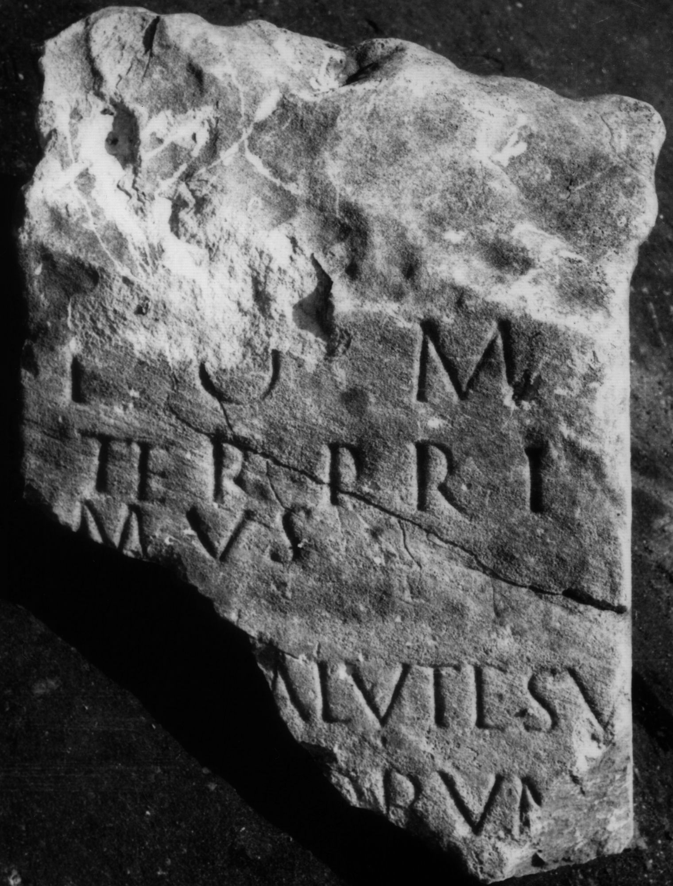

# EDH HD020596. Colonia Ulpia Traiana Sarmizegetusa

**Країна.** Румунія

**Провінція (код EDH).** Dac

**Місце знахідки (антична назва).** Colonia Ulpia Traiana Sarmizegetusa

**Сучасна назва.** Sarmizegetusa

**Деталі знахідки.** {Museum}, bei

**Координати.** 45.518470132,22.787822484

**Зберігання.** Sarmizegetusa, Muz. Arh.

**Датування (роки, від'ємні до н. е.).** 101 … 300

**Тип пам'ятки.** Altar

**Розміри (висота, ширина, глибина, см).** -44.0 × -35.0 × -26.0

## Текст (латинь, скорочення розкрито)

```
I(ovi) O(ptimo) M(aximo) / Ter(entius) Pri/mus / [pro s]alute su/[a et su]orum [&
```

## Текст у вихідному записі

```
I O M / TER PRI / MVS / [ ]ALVTE SV / [ ]ORVM [
```

## Література

AE 1977, 0693.
- IDR 3, 2, 237; fig. 192 (Foto u. Zeichnung).
- I. Piso, Apulum 13, 1975, 678, Nr. 8; fig. 2, 8 (Foto u. Zeichnung). - AE 1977. #

## Фото



Джерело https://edh.ub.uni-heidelberg.de/edh/inschrift/HD020596, ліцензія CC BY-SA 4.0. Оригінальний XML в архіві сирі_дані/edh_xml.zip
