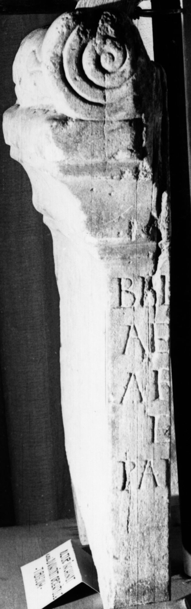

# EDH HD020599. Tibiscum

**Країна.** Румунія

**Провінція (код EDH).** Dac

**Місце знахідки (антична назва).** Tibiscum

**Сучасна назва.** Caransebeş

**Деталі знахідки.** Jupa, {Lager, südlich}

**Координати.** 45.464314528,22.190494536

**Рік знахідки.** 1969

**Зберігання.** Caransebeş, Muz. Jud. Etnogr.

**Датування (роки, від'ємні до н. е.).** 120 … 126

**Тип пам'ятки.** Altar

**Розміри (висота, ширина, глибина, см).** -52.0 × -37.0 × -14.0

## Текст (латинь, скорочення розкрито)

```
Bel[o] deo Palmyr(eno) / Ae[l(ius) Z]abdibol / arm[o]rum cus(tos) / e[x nu]mero Pal[myrenoru]m / [v(otum) s(olvit) l(ibens)] m(erito)
```

## Текст у вихідному записі

```
BEL[ ] DEO PALMYR / AE[ ]ABDIBOL / ARM[ ]RVM CVS / E[ ]MERO PAL[ ]M / [ ] M
```

## Коментар

Zwei nicht aneinander passende Fragmente erhalten. (B): Wollmann, AE 1971: Lediglich Wiedergabe des seinerzeit einzig bekannten linken Fragments.

## Література

AE 1977, 0694.
- AE 1971, 0405. (B)
- IDR 3, 1, 134; fig. 103 (Fotos u. Zeichnung).
- V. Wollmann, ActaMusNapoca 8, 1971, 552-553, Nr. 11; fig. 13 a u.b; fig. 13 c (Zeichnung). (B) - AE 1971.
- S. Sanie, StCercIstorV 27, 1976, 399-401, Nr. 1; fig. 1 a-c. - AE 1977. #

## Фото



Джерело https://edh.ub.uni-heidelberg.de/edh/inschrift/HD020599, ліцензія CC BY-SA 4.0. Оригінальний XML в архіві сирі_дані/edh_xml.zip
