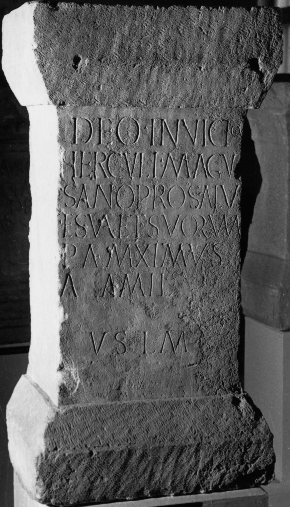

# EDH HD020617. Borşa

**Країна.** Румунія

**Провінція (код EDH).** Dac

**Сучасна назва.** Borşa

**Деталі знахідки.** {Ciumăfaia, Dombor, Berg, obere Terrasse}

**Координати.** 46.958665480,23.619754479

**Зберігання.** Cluj-Napoca, Muz. Naţ. Ist. Transilv.

**Датування (роки, від'ємні до н. е.).** 121 … 170

**Матеріал.** Sandstein

**Тип пам'ятки.** Altar

**Розміри (висота, ширина, глибина, см).** 112.0 × 57.0 × 40.0

## Текст (латинь, скорочення розкрито)

```
Deo Invicto / Herculi Magu/sano pro salu/te sua et suorum / P(ublius) Ael(ius) Maximus / a {a} mil(itiis) / v(otum) s(olvit) l(ibens) m(erito)
```

## Текст у вихідному записі

```
DEO INVICTO / HERCVLI MAGV / SANO PRO SALV / TE SVA ET SVORVM / P AEL MAXIMVS / A A MIL / V S L M
```

## Коментар

(B): AE 1977: Z. 4: suo et suorum.

## Література

AE 1977, 0702. (B)
- ILD 582.
- V. Wollmann, Germania 53, 1975, 173-174; Abb. 3 (Zeichnung). - AE 1977. #

## Фото



Джерело https://edh.ub.uni-heidelberg.de/edh/inschrift/HD020617, ліцензія CC BY-SA 4.0. Оригінальний XML в архіві сирі_дані/edh_xml.zip
