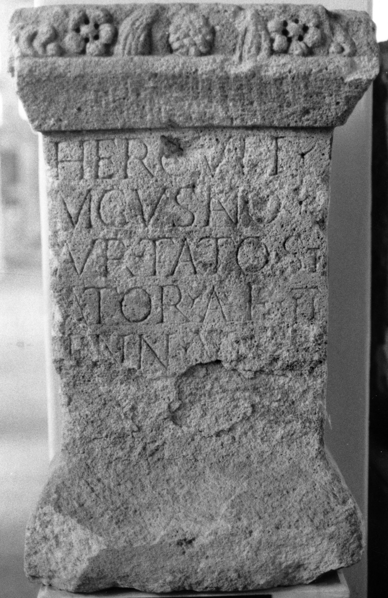
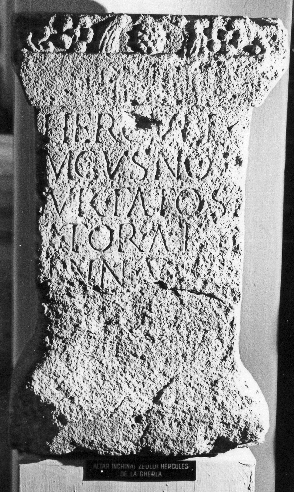

# EDH HD020620. Gherla

**Країна.** Румунія

**Провінція (код EDH).** Dac

**Сучасна назва.** Gherla

**Деталі знахідки.** {Lager}

**Координати.** 47.022119574,23.892924785

**Зберігання.** Cluj-Napoca, Muz. Naţ. Ist. Transilv.

**Датування (роки, від'ємні до н. е.).** 151 … 250

**Тип пам'ятки.** Altar

**Розміри (висота, ширина, глибина, см).** 85.0 × 50.0 × 32.0

## Текст (латинь, скорочення розкрито)

```
Herculi / Magusano / Aur(elius) Tato st/ator al(ae) II / Pann(oniorum) / v(otum) [s(olvit)] / l(ibens) [m(erito)]
```

## Текст у вихідному записі

```
HERCVLI / MAGVSANO / AVR TATO ST / ATOR AL II / PANN / V [ ] / L [ ]
```

## Коментар

(B): Z. 5/6: abweichende Textverteilung.

## Література

AE 1977, 0704. (B)
- ILD 590. (B)
- V. Wollmann, Germania 53, 1975, 172-173; Abb. 2 (Zeichnung). - AE 1977.
- M. Jaczynowska, AArchSlov 28, 1977, 414, Nr. 16. (B) - AE 1977.
- R. Zăgreanu, RevBistr 21, 1, 2007, 255, Nr. b; fig. 2. #

## Фото





Джерело https://edh.ub.uni-heidelberg.de/edh/inschrift/HD020620, ліцензія CC BY-SA 4.0. Оригінальний XML в архіві сирі_дані/edh_xml.zip
