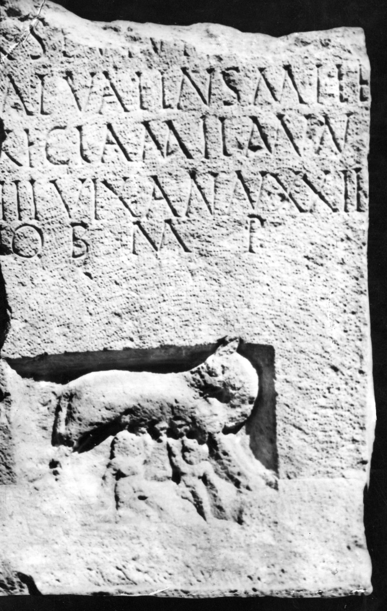

# EDH HD020749. Ibida

**Країна.** Румунія

**Провінція (код EDH).** MoI

**Місце знахідки (антична назва).** Ibida

**Сучасна назва.** Slava Cercheză

**Деталі знахідки.** Slava Rusă, {spätantike Festung}, Mauer, bei

**Координати.** 44.854309563,28.590464229

**Зберігання.** Constanţa, Muz. Ist. Naţ. Arh.

**Датування (роки, від'ємні до н. е.).** 171 … 300

**Матеріал.** Kalkstein

**Тип пам'ятки.** Stele

**Розміри (висота, ширина, глибина, см).** -124.0 × -72.0 × 24.0

## Текст (латинь, скорочення розкрито)

```
$]/[---]R(?) se vivi(?) [---]A(?) / [- V]al(erius) Valens mile/[s l(egionis)] XI Cla(udiae) mil(itavit) ann/[os] III vix(it) ann(os) XXII / [fil]io b(ene) m(erenti) p(osuerunt)
```

## Текст у вихідному записі

```
] / [ ]R SE VIVI [ ]A / [ ]AL VALENS MILE / [ ] XI CLA MIL ANN / [ ] III VIX ANN XXII / [ ]IO B M P
```

## Коментар

Unterhalb der Inschrift Darstellung der römischen Wölfin mit den Zwillingen. (B): AE 1977; IScM V; Conrad: Abweichungen in der Lesung.

## Література

AE 1977, 0756. (B)
- S. Conrad, Die Grabstelen aus Moesia inferior. Untersuchungen zu Chronologie, Typologie und Ikonographie (Leipzig 2004) 188, Nr. 236; Taf. 138, 2. (B)
- IScM 5, 224; Foto. (B)
- A. Aricescu, StCercIstorV 27, 1976, 531-534; fig. 3; fig. 4 (Zeichnung). - AE 1977. #

## Фото



Джерело https://edh.ub.uni-heidelberg.de/edh/inschrift/HD020749, ліцензія CC BY-SA 4.0. Оригінальний XML в архіві сирі_дані/edh_xml.zip
