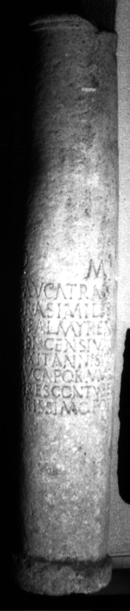
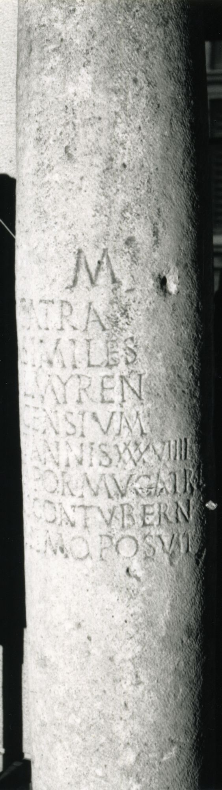

# EDH HD020990. Apulum

**Країна.** Румунія

**Провінція (код EDH).** Dac

**Місце знахідки (антична назва).** Apulum

**Сучасна назва.** Alba Iulia

**Деталі знахідки.** Dealul Furcilor, Sírok Utca

**Координати.** 46.058885575,23.570829285

**Зберігання.** Bucureşti, Muz. Naţ. Ist. Rom.

**Датування (роки, від'ємні до н. е.).** 151 … 230

**Матеріал.** Kalkstein

**Тип пам'ятки.** EhrenVotivsäule

**Розміри (висота, ширина, глибина, см).** -220.0 × 37.0

## Текст (латинь, скорочення розкрито)

```
D(is) M(anibus) / Mucatra / Brasi miles / n(umeri) Palmyren(orum) / Tibiscensium / vixit annis XXXVIIII / Mucapor Mucatral(is) / heres contubern(ali) / carissimo posuit
```

## Текст у вихідному записі

```
D M / MVCATRA / BRASI MILES / N PALMYREN / TIBISCENSIVM / VIXIT ANNIS XXXVIIII / MVCAPOR MVCATRAL / HERES CONTVBERN / CARISSIMO POSVIT
```

## Коментар

Säulenschaft.

## Література

AE 1914, 0102.
- G. von Finály, AA 1913, 332-333. - AE 1914.
- IDR 3, 5, 559; Foto u. Zeichnung. #

## Фото





Джерело https://edh.ub.uni-heidelberg.de/edh/inschrift/HD020990, ліцензія CC BY-SA 4.0. Оригінальний XML в архіві сирі_дані/edh_xml.zip
