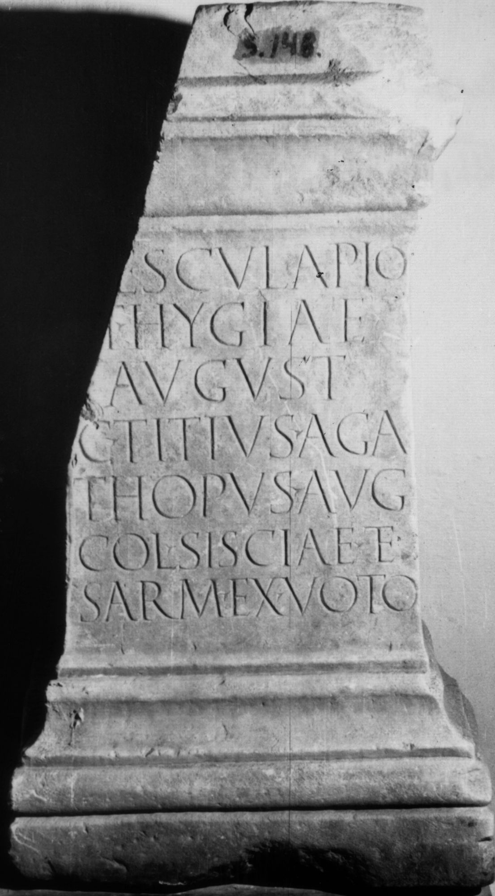

# EDH HD021011. Colonia Ulpia Traiana Sarmizegetusa

**Країна.** Румунія

**Провінція (код EDH).** Dac

**Місце знахідки (антична назва).** Colonia Ulpia Traiana Sarmizegetusa

**Сучасна назва.** Sarmizegetusa

**Деталі знахідки.** {Amphitheater}, bei

**Координати.** 45.516685035,22.785926378

**Зберігання.** Sarmizegetusa, Muz. Arh.

**Датування (роки, від'ємні до н. е.).** 107 … 250

**Тип пам'ятки.** Statuenbasis?

**Розміри (висота, ширина, глибина, см).** 82.0 × 42.0 × 38.0

## Текст (латинь, скорочення розкрито)

```
[A]esculapio / [e]t Hygiae / August(is) / C(aius) Titius Aga/thopus Aug(ustalis) / col(oniae) Sisciae et / Sarm(izegetusae) ex voto
```

## Текст у вихідному записі

```
[ ]ESCVLAPIO / [ ]T HYGIAE / AVGVST / C TITIVS AGA / THOPVS AVG / COL SISCIAE ET / SARM EX VOTO
```

## Література

AE 1914, 0109.
- IDR 3, 2, 165; fig. 135 (Foto u. Zeichnung).
- G. von Finály, AA 1913, 334, Nr. 10. - AE 1914. #

## Фото



Джерело https://edh.ub.uni-heidelberg.de/edh/inschrift/HD021011, ліцензія CC BY-SA 4.0. Оригінальний XML в архіві сирі_дані/edh_xml.zip
