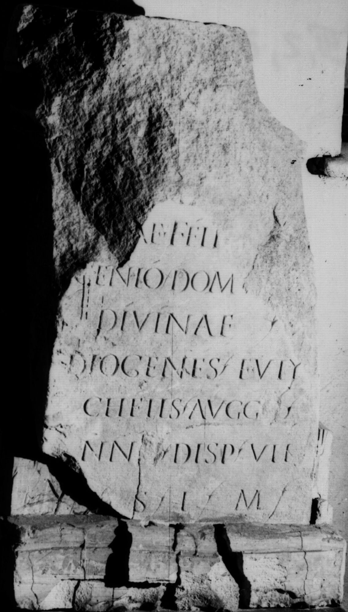

# EDH HD021023. Colonia Ulpia Traiana Sarmizegetusa

**Країна.** Румунія

**Провінція (код EDH).** Dac

**Місце знахідки (антична назва).** Colonia Ulpia Traiana Sarmizegetusa

**Сучасна назва.** Sarmizegetusa

**Координати.** 45.516666699,22.783333299

**Рік знахідки.** 1910

**Зберігання.** Sarmizegetusa, Muz. Arh.

**Датування (роки, від'ємні до н. е.).** 209 … 211

**Тип пам'ятки.** Altar

**Розміри (висота, ширина, глибина, см).** -79.0 × -38.0 × -26.0

## Текст (латинь, скорочення розкрито)

```
[--- Da]/[ci]ae Feli[cis et] / Genio dom[us] / divinae / Diogenes Euty/chetis Augg[[[g]]](ustorum) / nn[[[n]]](ostrorum) disp(ensatoris) vik(arius)(!) / v(otum) s(olvit) l(ibens) m(erito)
```

## Текст у вихідному записі

```
[ ] / [ ]AE FELI[ ] / GENIO DOM[ ] / DIVINAE / DIOGENES EVTY / CHETIS AVGG[[[ ]]] / NN[[[ ]]] DISP VIK / V S L M
```

## Коментар

(B): von Finály, AE 1914: abweichende Lesungen / Ergänzungen.

## Література

AE 1914, 0114. (B)
- AE 1927, p. 15 s. n. 55.
- IDR 3, 2, 216; fig. 174 (Foto u. Zeichnung).
- G. von Finály AA 1913, 335, Nr. 20. (B) - AE 1914.
- C. Daicoviciu, Dacia 1, 1924, 249-250, Nr. 1; fig. 13. - AE 1927. #

## Фото



Джерело https://edh.ub.uni-heidelberg.de/edh/inschrift/HD021023, ліцензія CC BY-SA 4.0. Оригінальний XML в архіві сирі_дані/edh_xml.zip
