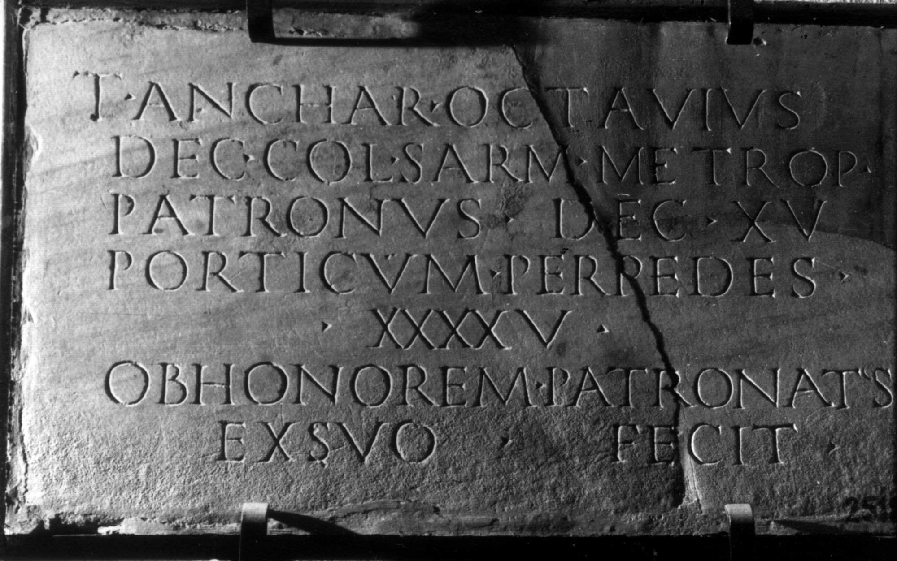

# EDH HD021029. Colonia Ulpia Traiana Sarmizegetusa

**Країна.** Румунія

**Провінція (код EDH).** Dac

**Місце знахідки (антична назва).** Colonia Ulpia Traiana Sarmizegetusa

**Сучасна назва.** Sarmizegetusa

**Деталі знахідки.** Forum Vetus, {Aedes fabrum}, bei

**Координати.** 45.513613965,22.788074827

**Рік знахідки.** 1913

**Зберігання.** Deva, Muz. Civil. Dac. şi Rom.

**Датування (роки, від'ємні до н. е.).** 222 … 270

**Тип пам'ятки.** Tafel

**Розміри (висота, ширина, глибина, см).** 37.0 × 72.0 × 2.0

## Текст (латинь, скорочення розкрито)

```
T(itus) Anchar(ius) Octavius / dec(urio) col(oniae) Sarm(izegetusae) metrop(olis) / patronus dec(uriae) XV / porticum per pedes / XXXXV / ob honorem patronatus / ex suo fecit
```

## Текст у вихідному записі

```
T ANCHAR OCTAVIVS / DEC COL SARM METROP / PATRONVS DEC XV / PORTICVM PER PEDES / XXXXV / OB HONOREM PATRONATVS / EX SVO FECIT
```

## Коментар

Datierung: Sarmizegetusa erhielt den Beinamen metropolis unter Severus Alexander.

## Література

AE 1914, 0116.
- IDR 3, 2, 010; fig. 8 (Foto u. Zeichnung).
- G. von Finály, AA 1913, 336. - AE 1914.
- I. Piso, in: I. Piso (Hrsg.), Le forum vetus de Sarmizegetusa 1 (Bucureşti 2006) 268-269, Nr. 44; Fig. 3, 42. #

## Фото



Джерело https://edh.ub.uni-heidelberg.de/edh/inschrift/HD021029, ліцензія CC BY-SA 4.0. Оригінальний XML в архіві сирі_дані/edh_xml.zip
