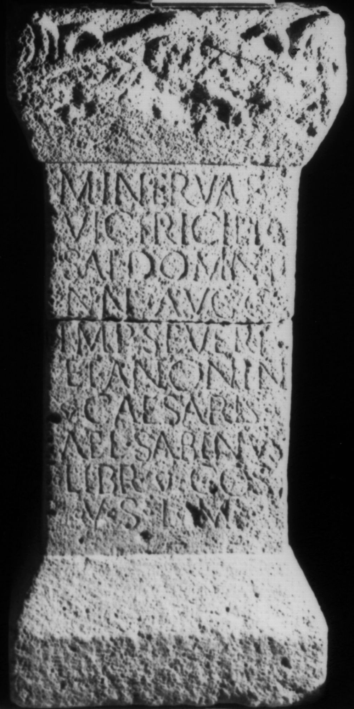

# EDH HD023177. Apulum

**Країна.** Румунія

**Провінція (код EDH).** Dac

**Місце знахідки (антична назва).** Apulum

**Сучасна назва.** Alba Iulia

**Деталі знахідки.** Praetorium des Statthalters

**Координати.** 46.076691,23.580099

**Рік знахідки.** 1895

**Зберігання.** Alba Iulia, Muz. Unirii

**Датування (роки, від'ємні до н. е.).** 196 … 197

**Матеріал.** Gesteine

**Тип пам'ятки.** Altar

**Розміри (висота, ширина, глибина, см).** 91.0 × 41.0 × 37.0

## Текст (латинь, скорочення розкрито)

```
Minervae / Victrici pro / sal(ute) dominn(orum) / nn(ostrorum) Augg(ustorum) / Imp(eratoris) Severi / et Antonini / Caesaris / Ael(ius) Sabinus / libr(arius) co(n)s(ularis) / v(otum) s(olvit) l(ibens) m(erito)
```

## Текст у вихідному записі

```
MINERVAE / VICTRICI PRO / SAL DOMINN / NN AVGG / IMP SEVERI / ET ANTONINI / CAESARIS / AEL SABINVS / LIBR COS / V S L M
```

## Коментар

Basis in zwei Teile gebrochen. Z. 9 u. 10: hederae.

## Література

AE 1896, 0058.
- IDR 3, 5, 266; Foto.
- J. Jung, AEM 19, 1896, 69-70; Foto. - AE 1896.
- CIL 03, 14215, 16. #

## Фото



Джерело https://edh.ub.uni-heidelberg.de/edh/inschrift/HD023177, ліцензія CC BY-SA 4.0. Оригінальний XML в архіві сирі_дані/edh_xml.zip
