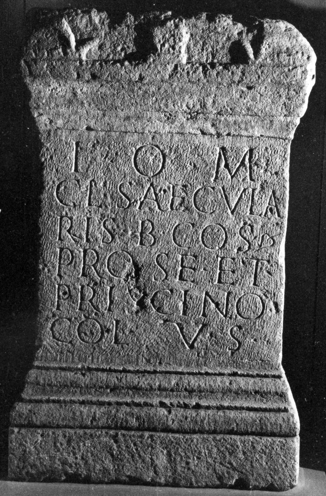

# EDH HD023643. Micia

**Країна.** Румунія

**Провінція (код EDH).** Dac

**Місце знахідки (антична назва).** Micia

**Сучасна назва.** Veţel

**Деталі знахідки.** {Lager}, nördlich

**Координати.** 45.912028,22.815583

**Зберігання.** Deva, Muz. Civil. Dac. şi Rom.

**Датування (роки, від'ємні до н. е.).** 151 … 200

**Тип пам'ятки.** Altar

**Розміри (висота, ширина, глибина, см).** 90.0 × 75.0 × 45.0

## Текст (латинь, скорочення розкрито)

```
I(ovi) O(ptimo) M(aximo) / Cl(audius) Saecula/ris b(eneficiarius) co(n)s(ularis) / pro se et / Priscino / col(lega) v(otum) s(olvit)
```

## Текст у вихідному записі

```
I O M / CL SAECVLA / RIS B COS / PRO SE ET / PRISCINO / COL V S
```

## Коментар

Hedera am Ende von Z. 3.

## Література

AE 1933, 0009.
- AE 1931, 0119.
- AE 1930, 0011.
- IDR 3, 3, 086; fig. 70 (Foto u. Zeichnung).
- E. Schallmayer - K. Eibl - J. Ott - G. Preuß - E. Wittkopf, Der römische Weihebezirk von Osterburken 1 (Stuttgart 1990) 430-431, Nr. 563; Foto.
- C. Daicoviciu, ACM 3, 1930/31, 39, Nr. 9. - AE 1931. 1933.
- C. Daicoviciu, ACM 2, 1929, 308-309, Nr. 1. - AE 1930. #

## Фото



Джерело https://edh.ub.uni-heidelberg.de/edh/inschrift/HD023643, ліцензія CC BY-SA 4.0. Оригінальний XML в архіві сирі_дані/edh_xml.zip
