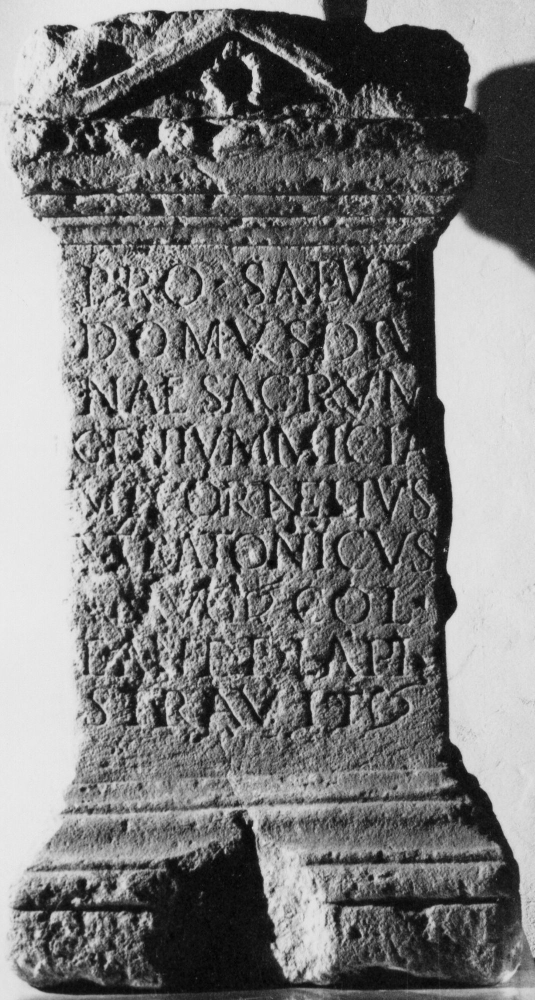

# EDH HD023646. Micia

**Країна.** Румунія

**Провінція (код EDH).** Dac

**Місце знахідки (антична назва).** Micia

**Сучасна назва.** Veţel

**Деталі знахідки.** {Micia}

**Координати.** 45.914556455,22.816629409

**Рік знахідки.** 1913

**Зберігання.** Deva, Muz. Civil. Dac. şi Rom.

**Датування (роки, від'ємні до н. е.).** 201 … 270

**Матеріал.** Kalkstein

**Тип пам'ятки.** Altar

**Розміри (висота, ширина, глибина, см).** 120.0 × 63.0 × 43.0

## Текст (латинь, скорочення розкрито)

```
Pro salute / domus divi/nae sacrum / Genium(!) Miciae / M(arcus) Cornelius / Stratonicus / Aug(ustalis) col(oniae) / et ante f(rontem) lapi(dibus) / stravit
```

## Текст у вихідному записі

```
PRO SALVTE / DOMVS DIVI / NAE SACRVM / GENIVM MICIAE / M CORNELIVS / STRATONICVS / AVG COL / ET ANTE F LAPI / STRAVIT
```

## Коментар

Auf der linken Nebenseite patera, auf der rechten urceus. Hederae in Z. 7 und 9. (B): Daicoviciu; AE 1931; AE 1933: Z. 2: div[i].

## Література

AE 1931, 0120. (B)
- AE 1933, 0010. (B)
- IDR 3, 3, 071; fig. 58 (Foto u. Zeichnung).
- C. Daicoviciu, ACM 3, 1930/31, 39-40, Nr. 11. (B) - AE 1931. 1933. #

## Фото



Джерело https://edh.ub.uni-heidelberg.de/edh/inschrift/HD023646, ліцензія CC BY-SA 4.0. Оригінальний XML в архіві сирі_дані/edh_xml.zip
