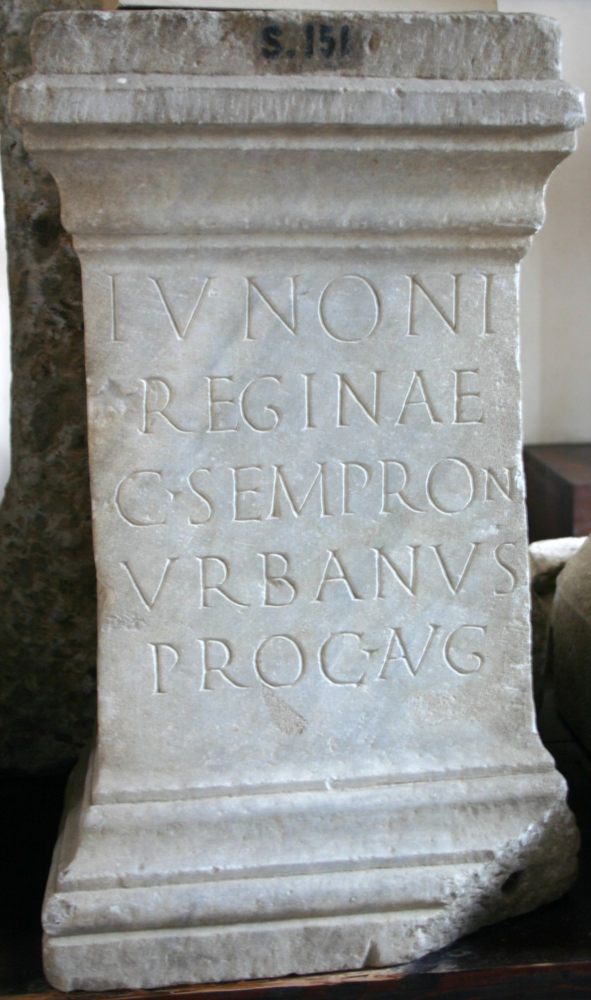

# EDH HD023658. Colonia Ulpia Traiana Sarmizegetusa

**Країна.** Румунія

**Провінція (код EDH).** Dac

**Місце знахідки (антична назва).** Colonia Ulpia Traiana Sarmizegetusa

**Сучасна назва.** Sarmizegetusa

**Деталі знахідки.** {Praetorium procuratoris}

**Координати.** 45.514961240,22.787961957

**Зберігання.** Sarmizegetusa, Muz. Arh.

**Датування (роки, від'ємні до н. е.).** 182 … 185

**Тип пам'ятки.** Altar

**Розміри (висота, ширина, глибина, см).** 41.0 × 28.5

## Текст (латинь, скорочення розкрито)

```
Iunoni / Reginae / C(aius) Sempron(ius) / Urbanus / proc(urator) Aug(usti)
```

## Текст у вихідному записі

```
IVNONI / REGINAE / C SEMPRON / VRBANVS / PROC AVG
```

## Коментар

Datierung: C. Sempronius Urbanus war bald nach 181 n. Chr. Finanzprokurator von Dakien.

## Література

AE 1930, 0137.
- AE 1933, 0015.
- AE 1996, 0873.
- IDR 3, 2, 231; fig. 186.
- H.-G. Pflaum, Les carrières procuratoriennes équestres sous le Haut-Empire romain (Paris 1960/61) 542-543, Nr. 200, 4.
- C. Daicoviciu, AISC 1, 1, 1928-1932, 86, Nr. 4; fig. 3 b. - AE 1930, AE 1933.
- S. Dardaine, Ktema 21, 1996, 295-304. - AE 1996. #

## Фото



Джерело https://edh.ub.uni-heidelberg.de/edh/inschrift/HD023658, ліцензія CC BY-SA 4.0. Оригінальний XML в архіві сирі_дані/edh_xml.zip
