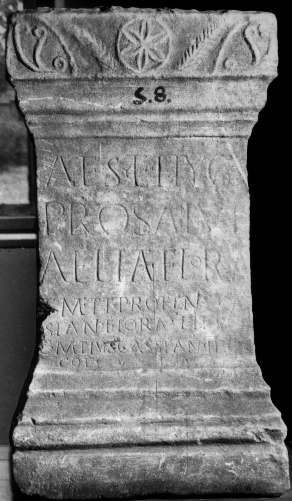

# EDH HD023670. Colonia Ulpia Traiana Sarmizegetusa

**Країна.** Румунія

**Провінція (код EDH).** Dac

**Місце знахідки (антична назва).** Colonia Ulpia Traiana Sarmizegetusa

**Сучасна назва.** Sarmizegetusa

**Координати.** 45.516666699,22.783333299

**Зберігання.** Sarmizegetusa, Muz. Arh.

**Датування (роки, від'ємні до н. е.).** 107 … 250

**Тип пам'ятки.** Altar

**Розміри (висота, ширина, глибина, см).** 70.0 × 30.0 × 35.0

## Текст (латинь, скорочення розкрито)

```
Aes(culapio) et Hyg(iae) / pro salute / Aeliae Florae / et Metti(orum) Proteni Cas/sian(i) Florae filiae / C(aius) Met(t)ius Cassian(us) IIvir / col(oniae) v(otum) s(olvit) l(ibens) m(erito)
```

## Текст у вихідному записі

```
AES ET HYG / PRO SALVTE / AELIAE FLORAE / ET METTI PROTENI CAS / SIAN FLORAE FILIAE / C METIVS CASSIAN IIVIR / COL V S L M
```

## Коментар

(B): abweichende Textwiedergaben.

## Література

AE 1933, 0019. (B)
- AE 1914, 0111. (B)
- IDR 3, 2, 153; fig. 125 (Foto u. Zeichnung).
- O. Floca, AISC 1, 1, 1928-1932, 103-105, Nr. 2, fig. 2. (B) - AE 1933.
- G. von Finály, AA 1913, 335, Nr. 12. (B) - AE 1914.
- B. Jánó, AErt 32, 1912, 406. (B) - AE 1914. #

## Фото



Джерело https://edh.ub.uni-heidelberg.de/edh/inschrift/HD023670, ліцензія CC BY-SA 4.0. Оригінальний XML в архіві сирі_дані/edh_xml.zip
