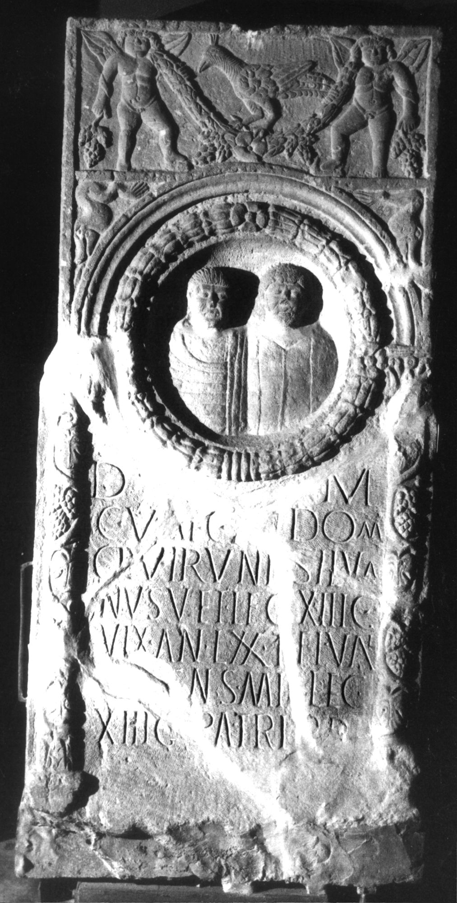

# EDH HD023679. Apulum

**Країна.** Румунія

**Провінція (код EDH).** Dac

**Місце знахідки (антична назва).** Apulum

**Сучасна назва.** Alba Iulia

**Деталі знахідки.** {Partoş}

**Координати.** 46.0463184,23.566650100

**Рік знахідки.** 1930

**Зберігання.** Alba Iulia, Muz. Unirii

**Датування (роки, від'ємні до н. е.).** 151 … 200

**Матеріал.** Kalkstein

**Тип пам'ятки.** Stele

**Розміри (висота, ширина, глибина, см).** 190.0 × 95.0 × 24.0

## Текст (латинь, скорочення розкрито)

```
D(is) M(anibus) / C(aius) Val(erius) C(ai) fil(ius) dom(o) / Cl(audia) Viruni Silva/nus vet(eranus) leg(ionis) XIII g(eminae) / vix(it) an(nos) LXX T(itus) Fl(avius) Val(erius) / Valens mil(es) leg(ionis) / XIII g(eminae) patri p(iissimo) p(osuit)
```

## Текст у вихідному записі

```
D M / C VAL C FIL DOM / CL VIRVNI SILVA / NVS VET LEG XIII G / VIX AN LXX T FL VAL / VALENS MIL LEG / XIII G PATRI P P
```

## Література

AE 1933, 0022.
- C. Daicoviciu, AISC 1, 1, 1928-1932, 123-126, Nr. 9; fig. 13-15. - AE 1933.
- AE 1934, 0117.
- V. Christescu, Dacia 3/4, 1927-1932, 624-625; fig. 6. - AE 1934.
- IDR 3, 5, 591; Foto u. Zeichnung.
- AE 2004, 1181.
- E. Weber, in: L. Ruscu - C. Ciongradi - R. Ardevan - C. Roman - C. Găzdac (Hrsg.), Orbis Antiquus. Studia in honorem Ioannis Pisonis (Cluj-Napoca 2004) 818-819. - AE 2004.
- C. Ciongradi, Grabmonument und sozialer Status in Oberdakien (Cluj-Napoca 2007) 164-165, Nr. S/A 20; Taf. 43. #

## Фото



Джерело https://edh.ub.uni-heidelberg.de/edh/inschrift/HD023679, ліцензія CC BY-SA 4.0. Оригінальний XML в архіві сирі_дані/edh_xml.zip
