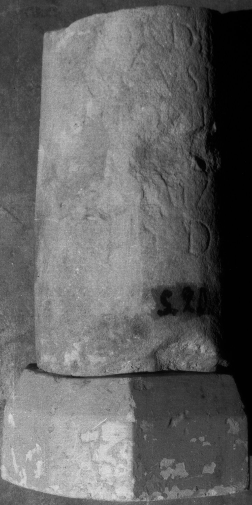
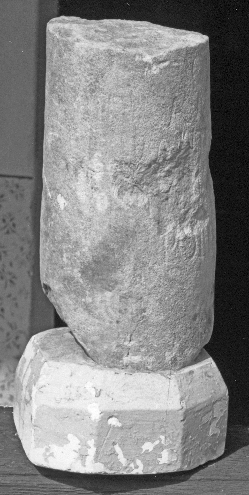
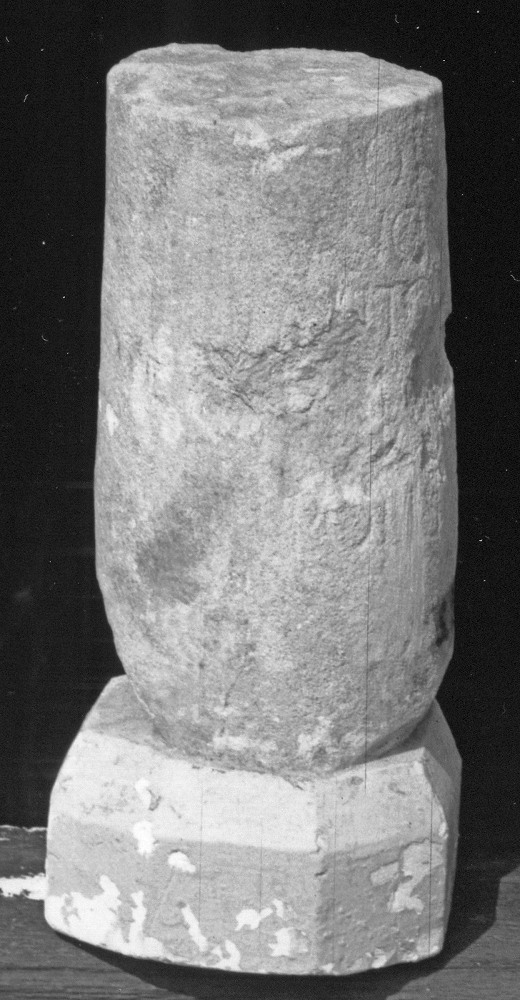
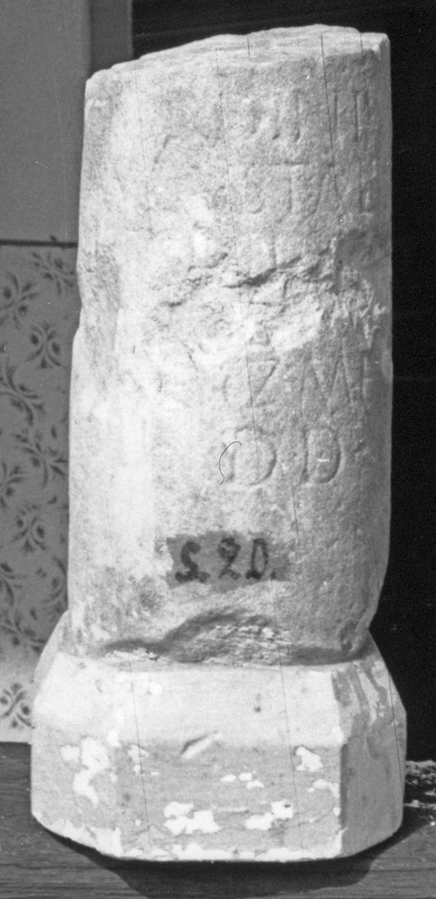
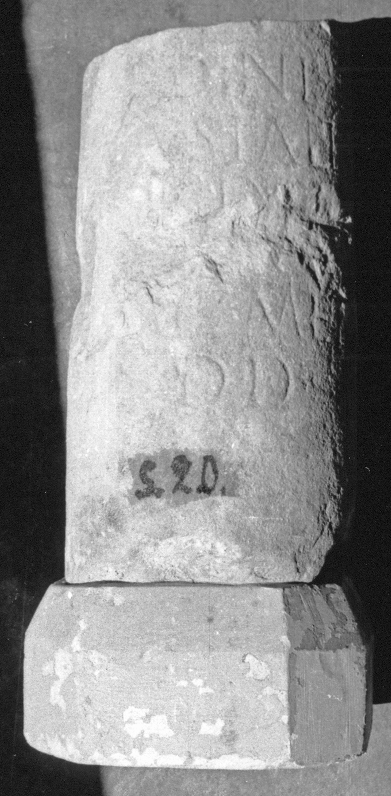
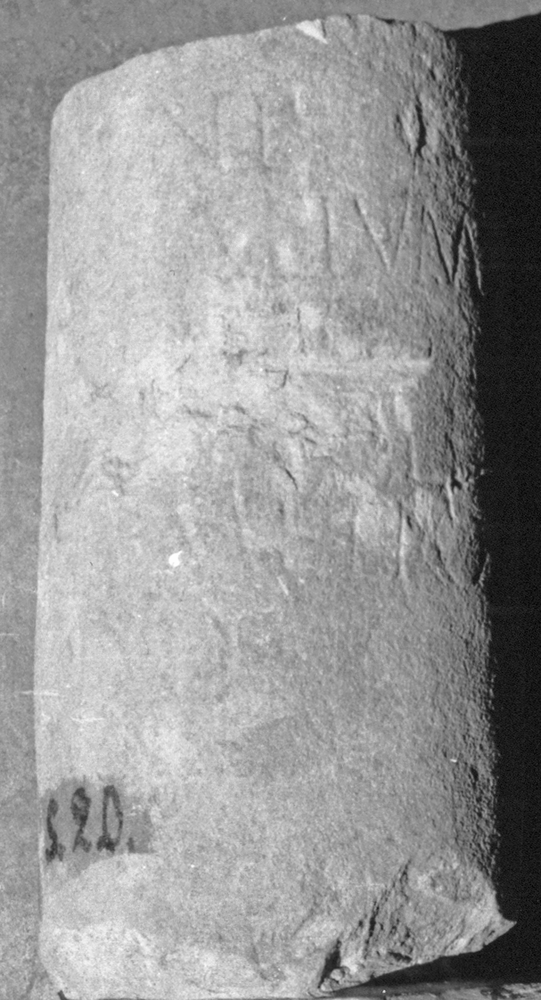
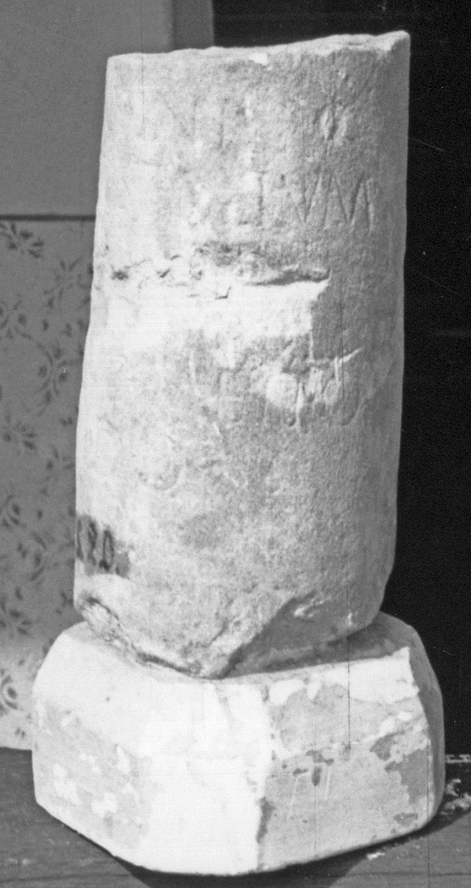

# EDH HD024120. Colonia Ulpia Traiana Sarmizegetusa

**Країна.** Румунія

**Провінція (код EDH).** Dac

**Місце знахідки (антична назва).** Colonia Ulpia Traiana Sarmizegetusa

**Сучасна назва.** Sarmizegetusa

**Деталі знахідки.** Forum Vetus, {Basilica}

**Координати.** 45.513091122,22.787825166

**Зберігання.** Sarmizegetusa, Muz. Arh.

**Датування (роки, від'ємні до н. е.).** 222 … 270

**Тип пам'ятки.** EhrenVotivsäule

**Розміри (висота, ширина, глибина, см).** -30.0 × 16.0

## Текст (латинь, скорочення розкрито)

```
Ordini / Augustalium / P(ublius) Antonius / Super dec(urio) col(oniae) / Sarmiz(egetusae) metro/polis d(ono) d(edit)
```

## Текст у вихідному записі

```
ORDINI / AVGVSTALIVM / P ANTONIVS / SVPER DEC COL / SARMIZ METRO / POLIS D D
```

## Коментар

Fragment eines Säulenschaftes; ein Teil der Inschrift wurde nach der Auffindung beschädigt. Datierung: Sarmizegetusa erhielt den Beinamen metropolis unter Severus Alexander.

## Література

AE 1933, 0241.
- IDR 3, 2, 134; fig. 108 (Foto u. Zeichnung).
- I. Piso, in: I. Piso (Hrsg.), Le forum vetus de Sarmizegetusa 1 (Bucureşti 2006) 250, Nr. 30; fig. 3, 28. #

## Фото















Джерело https://edh.ub.uni-heidelberg.de/edh/inschrift/HD024120, ліцензія CC BY-SA 4.0. Оригінальний XML в архіві сирі_дані/edh_xml.zip
