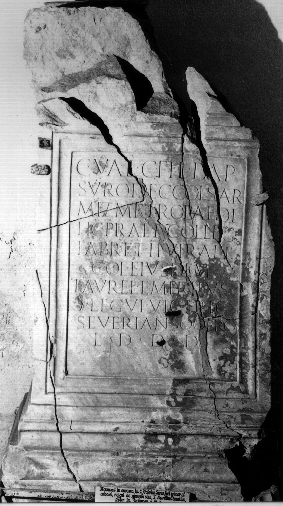

# EDH HD024138. Colonia Ulpia Traiana Sarmizegetusa

**Країна.** Румунія

**Провінція (код EDH).** Dac

**Місце знахідки (антична назва).** Colonia Ulpia Traiana Sarmizegetusa

**Сучасна назва.** Sarmizegetusa

**Деталі знахідки.** {Forum Vetus} - {Forum Novum}, zwischen

**Координати.** 45.512972711,22.788053154

**Зберігання.** Sarmizegetusa, Muz. Arh.

**Датування (роки, від'ємні до н. е.).** 222 … 250

**Тип пам'ятки.** Statuenbasis?

**Розміри (висота, ширина, глибина, см).** -157.0 × -90.0 × -62.0

## Текст (латинь, скорочення розкрито)

```
C(aio) Val(erio) C(ai) fil(io) Pap(iria) / Suro dec(urioni) col(oniae) Sar/miz(egetusae) metrop(olis) aedi/lic(io) praef(ecto) colleg(ii) / fabr(um) et IIvirali / col(oniae) eiusdem / T(itus) Aurel(ius) Emeritus / |(centurio) leg(ionis) VI victric(is) / Severian(ae) socero / l(ocus) d(atus) d(ecreto) d(ecurionum)
```

## Текст у вихідному записі

```
C VAL C FIL PAP / SVRO DEC COL SAR / MIZ METROP AEDI / LIC PRAEF COLLEG / FABR ET IIVIRALI / COL EIVSDEM / T AVREL EMERITVS / | LEG VI VICTRIC / SEVERIAN SOCERO / L D D D
```

## Коментар

Datierung: Sarmizegetusa erhielt den Beinamen metropolis unter Severus Alexander.

## Література

AE 1933, 0247.
- IDR 3, 2, 124; fig. 99 (Foto u. Zeichnung).
- C. Daicoviciu, Dacia 3/4, 1927-1929, 548-549, Nr. 2; fig. 54. - AE 1933. #

## Фото



Джерело https://edh.ub.uni-heidelberg.de/edh/inschrift/HD024138, ліцензія CC BY-SA 4.0. Оригінальний XML в архіві сирі_дані/edh_xml.zip
