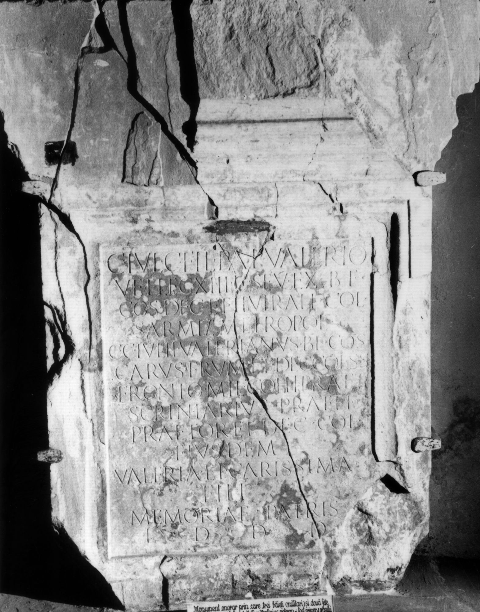

# EDH HD024141. Colonia Ulpia Traiana Sarmizegetusa

**Країна.** Румунія

**Провінція (код EDH).** Dac

**Місце знахідки (антична назва).** Colonia Ulpia Traiana Sarmizegetusa

**Сучасна назва.** Sarmizegetusa

**Деталі знахідки.** {Forum Vetus} - {Forum Novum}, zwischen

**Координати.** 45.512972711,22.788053154

**Зберігання.** Sarmizegetusa, Muz. Arh.

**Датування (роки, від'ємні до н. е.).** 222 … 235

**Тип пам'ятки.** Statuenbasis

**Розміри (висота, ширина, глибина, см).** -161.0 × 97.0 × -30.0

## Текст (латинь, скорочення розкрито)

```
C(aio) Iul(io) C(ai) fil(io) Pap(iria) Valerio / vet(erano) leg(ionis) XIII g(eminae) Sev(erianae) ex b(ene)f(iciario) / co(n)s(ularis) dec(urioni) et IIvirali col(oniae) / Sarmiz(egetusae) metropol(is) / CC(ai) Iulii Valerianus b(ene)f(iciarius) co(n)s(ularis) / Carus frum(entarius) et dec(urio) col(oniae) s(upra) s(criptae) / Fronto mil(es) coh(ortis) I praet(oriae) / scriniarius praeff(ectorum) / praetor(io) et dec(urio) col(oniae) / eiusdem / Valeria et Carissima / fili(i) / memoriae patris / l(ocus) d(atus) d(ecreto) d(ecurionum)
```

## Текст у вихідному записі

```
C IVL C FIL PAP VALERIO / VET LEG XIII G SEV EX BF / COS DEC ET IIVIRALI COL / SARMIZ METROPOL / CC IVLII VALERIANVS BF COS / CARVS FRVM ET DEC COL S S / FRONTO MIL COH I PRAET / SCRINIARIVS PRAEFF / PRAETOR ET DEC COL / EIVSDEM / VALERIA ET CARISSIMA / FILI / MEMORIAE PATRIS / L D D D
```

## Коментар

Mehrere aneinanderpassende Fragmente. (B): Daicoviciu; AE 1933; IDR III 2: Abweichungen in der Lesung.

## Література

AE 1933, 0248. (B)
- IDR 3, 2, 113; fig. 88. (B)
- E. Schallmayer - K. Eibl - J. Ott - G. Preuß - E. Wittkopf, Der römische Weihebezirk von Osterburken 1 (Stuttgart 1990) 420, Nr. 548; Foto.
- C. Daicoviciu, Dacia 3/4, 1927-1932, 549-551, Nr. 3; fig. 55. (B) - AE 1933. #

## Фото



Джерело https://edh.ub.uni-heidelberg.de/edh/inschrift/HD024141, ліцензія CC BY-SA 4.0. Оригінальний XML в архіві сирі_дані/edh_xml.zip
