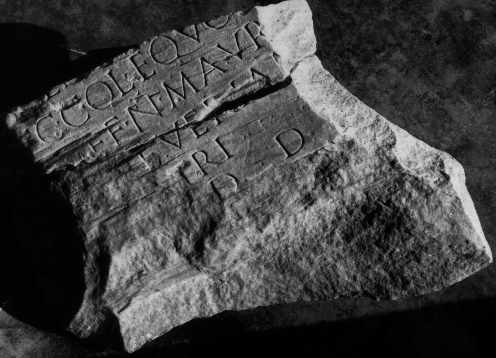

# EDH HD024147. Colonia Ulpia Traiana Sarmizegetusa

**Країна.** Румунія

**Провінція (код EDH).** Dac

**Місце знахідки (антична назва).** Colonia Ulpia Traiana Sarmizegetusa

**Сучасна назва.** Sarmizegetusa

**Деталі знахідки.** {Forum Vetus} - {Forum Novum}, zwischen

**Координати.** 45.512972711,22.788053154

**Зберігання.** Sarmizegetusa, Muz. Arh.

**Датування (роки, від'ємні до н. е.).** 151 … 250

**Тип пам'ятки.** Statuenbasis

## Текст (латинь, скорочення розкрито)

```
$] / [---]E(?)I(?)[---] / [de]c(urioni) col(oniae) equo [pub(lico)] / [pr]aef(ecto) n(umeri) Maur(orum) [M(iciensium)?] / [--- S]everian[us] / [pa]tri / [l(ocus) d(atus)] d(ecreto) d(ecurionum)
```

## Текст у вихідному записі

```
] / [ ]EI[ ] / [ ]C COL EQVO [ ] / [ ]AEF N MAVR [ ] / [ ]EVERIAN[ ] / [ ]TRI / [ ] D D
```

## Коментар

2 aneinanderpassende Fragmente. (B): Daicoviciu; AE 1933; IDR III 2: Abweichungen in Lesung und Ergänzung.

## Література

AE 1933, 0250. (B)
- IDR 3, 2, 133; fig. 107 (Foto u. Zeichnung). (B)
- C. Daicoviciu, Dacia 3/4, 1927-1932, 553-555, Nr. 5; fig. 57. (B) - AE 1933. #

## Фото



Джерело https://edh.ub.uni-heidelberg.de/edh/inschrift/HD024147, ліцензія CC BY-SA 4.0. Оригінальний XML в архіві сирі_дані/edh_xml.zip
