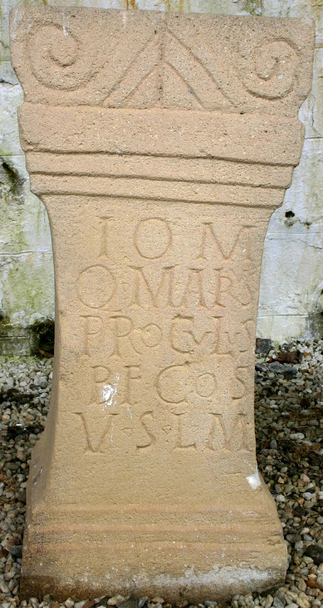
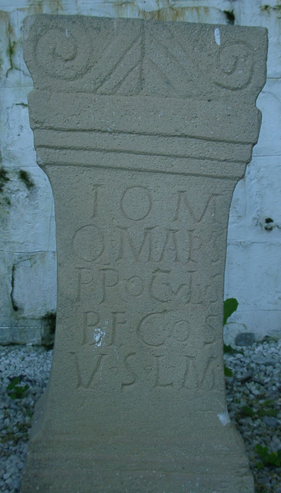

# EDH HD024873. Alburnus Maior

**Країна.** Румунія

**Провінція (код EDH).** Dac

**Місце знахідки (антична назва).** Alburnus Maior

**Сучасна назва.** Roşia Montană

**Деталі знахідки.** {Hăbad, Hügel}, römischer Weihbezirk

**Координати.** 46.292384794,23.113185167

**Рік знахідки.** 1983

**Зберігання.** Roşia Montană, Muzeul

**Датування (роки, від'ємні до н. е.).** 151 … 200

**Матеріал.** Tuff

**Тип пам'ятки.** Altar

**Розміри (висота, ширина, глибина, см).** 85.0 × 26.0 × 24.0

## Текст (латинь, скорочення розкрито)

```
I(ovi) O(ptimo) M(aximo) / Q(uintus) Marius / Proculus / b(ene)f(iciarius) co(n)s(ularis) / v(otum) s(olvit) l(ibens) m(erito)
```

## Текст у вихідному записі

```
I O M / Q MARIVS / PROCVLVS / BF COS / V S L M
```

## Коментар

Hederae.

## Література

AE 1990, 0827.
- C.C. Petolescu, StCercIstorV 39, 2, 1988, 403, Nr. 417. - AE 1990.
- ILD 359.
- E. Schallmayer - K. Eibl - J. Ott - G. Preuß - E. Wittkopf, Der römische Weihebezirk von Osterburken 1 (Stuttgart 1990) 419-420, Nr. 547; Foto.
- C. Ciongradi, Die römischen Steindenkmäler aus Alburnus Maior (Cluj-Napoca 2009) 48-49, Nr. 21; Taf. 15, 21. #

## Фото





Джерело https://edh.ub.uni-heidelberg.de/edh/inschrift/HD024873, ліцензія CC BY-SA 4.0. Оригінальний XML в архіві сирі_дані/edh_xml.zip
