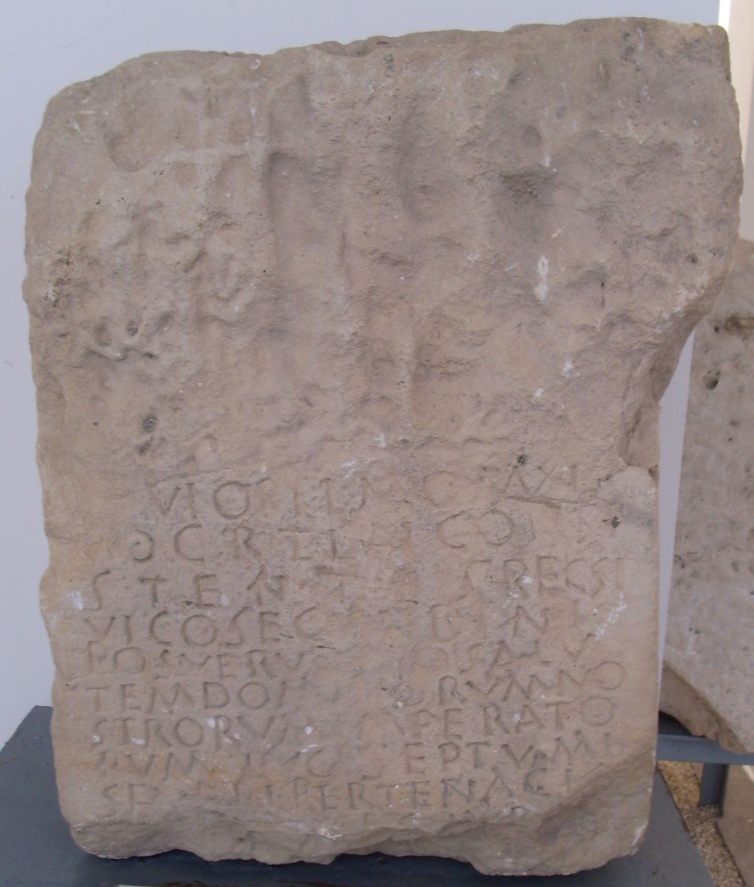

# EDH HD024928. Istrus

**Країна.** Румунія

**Провінція (код EDH).** MoI

**Місце знахідки (антична назва).** Istrus

**Сучасна назва.** Istria

**Деталі знахідки.** spätantike Festung, {Kurtine k / Turm I}, sekundär verwendet

**Координати.** 44.546712981,28.772765718

**Зберігання.** Istria, Muzeul

**Датування (роки, від'ємні до н. е.).** 198 … 211

**Тип пам'ятки.** Altar?

**Розміри (висота, ширина, глибина, см).** -58.0 × -40.0 × -35.0

## Текст (латинь, скорочення розкрито)

```
[I]ovi Optimo Maxi/mo c(ives) R(omani) et Lai consi/stentes reg(ione) Si(tri)(!) / vico Secundini / posueru[nt p]ro salu/tem(!) dominorum no/strorum Imperato/rum Luci Septumi(!) / Severi Pertenaci[s](!) / [et Impera]t(oris) Ma[rci] Aur[eli] / [Antonini &
```

## Текст у вихідному записі

```
[ ]OVI OPTIMO MAXI / MO C R ET LAI CONSI / STENTES REG SI / VICO SECVNDINI / POSVERV[ ]RO SALV / TEM DOMINORVM NO / STRORVM IMPERATO / RVM LVCI SEPTVMI / SEVERI PERTENACI[ ] / [ ]T MA[ ] AVR[ ] / [
```

## Коментар

Altar oder Statuenbasis. Z. 3: wohl Si(tri) für His(tri).

## Література

AE 1927, 0062.
- IScM 1, 343; Foto.
- V. Pârvan, Dacia 2, 1925, 241-244, Nr. 41; fig. 65; fig. 66 (Zeichnung). - AE 1927.
- S. Lambrino, in: J. Marouzeau (Hrsg.), Mélanges de philologie, de littérature et d'histoire anciennes offerts à J. Marouzeau (Paris 1948) 321-322, Nr. 8. #

## Фото



Джерело https://edh.ub.uni-heidelberg.de/edh/inschrift/HD024928, ліцензія CC BY-SA 4.0. Оригінальний XML в архіві сирі_дані/edh_xml.zip
