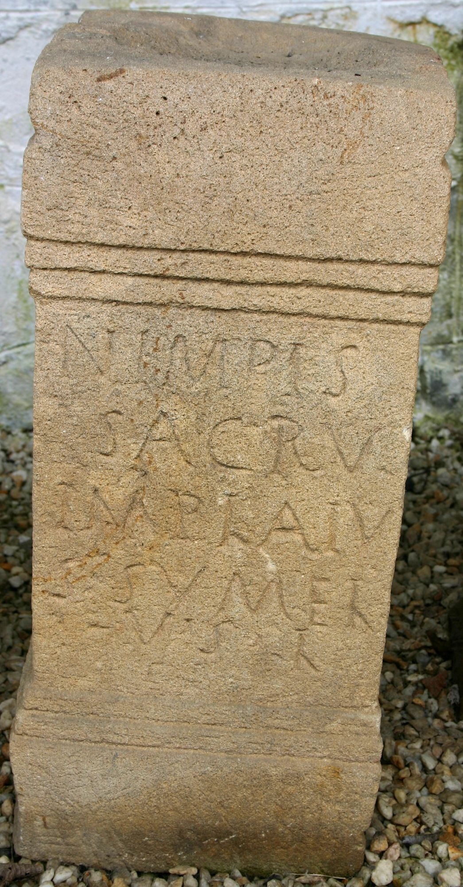

# EDH HD024930. Alburnus Maior

**Країна.** Румунія

**Провінція (код EDH).** Dac

**Місце знахідки (антична назва).** Alburnus Maior

**Сучасна назва.** Roşia Montană

**Деталі знахідки.** {Hăbad, Hügel}, römischer Weihbezirk

**Координати.** 46.292384794,23.113185167

**Рік знахідки.** 1983

**Зберігання.** Roşia Montană, Muzeul

**Датування (роки, від'ємні до н. е.).** 107 … 250

**Матеріал.** Tuff

**Тип пам'ятки.** Altar

**Розміри (висота, ширина, глибина, см).** 60.0 × 28.0 × 24.5

## Текст (латинь, скорочення розкрито)

```
Nimp(h)is(!) / sacru(m) / Implaiu/s Sumel(etis) / v(otum) s(olvit) l(ibens)
```

## Текст у вихідному записі

```
NIMPIS / SACRV / IMPLAIV / S SVMEL / V S L
```

## Коментар

(B): AE 1990: Z. 2: sacrum; Petolescu, AE 1990, ILD: Z. 4: sum(m)e l(aetus?).

## Література

AE 1990, 0846. (B)
- C.C. Petolescu, StCercIstorV 39, 2, 1988, 407, Nr. 438. (B) - AE 1990.
- ILD 380. (B)
- C. Ciongradi, Die römischen Steindenkmäler aus Alburnus Maior (Cluj-Napoca 2009) 76-77, Nr. 83; Taf. 38, 83. #

## Фото



Джерело https://edh.ub.uni-heidelberg.de/edh/inschrift/HD024930, ліцензія CC BY-SA 4.0. Оригінальний XML в архіві сирі_дані/edh_xml.zip
