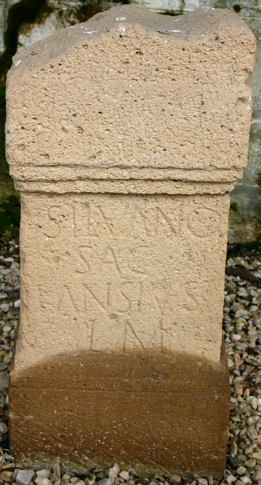

# EDH HD024936. Alburnus Maior

**Країна.** Румунія

**Провінція (код EDH).** Dac

**Місце знахідки (антична назва).** Alburnus Maior

**Сучасна назва.** Roşia Montană

**Деталі знахідки.** {Hăbad, Hügel}, römischer Weihbezirk

**Координати.** 46.292384794,23.113185167

**Рік знахідки.** 1983

**Зберігання.** Roşia Montană, Muzeul

**Датування (роки, від'ємні до н. е.).** 107 … 250

**Матеріал.** Kalkstein

**Тип пам'ятки.** Altar

**Розміри (висота, ширина, глибина, см).** 64.0 × 31.0 × 25.0

## Текст (латинь, скорочення розкрито)

```
Silvano / sac(rum) / k(astellum) Ansi(s) v(otum) s(olvit) / l(ibens) m(erito)
```

## Текст у вихідному записі

```
SILVANO / SAC / K ANSI V S / L M
```

## Література

AE 1990, 0848.
- C.C. Petolescu, StCercIstorV 39, 2, 1988, 407, Nr. 440. - AE 1990.
- ILD 382.
- C. Ciongradi, Die römischen Steindenkmäler aus Alburnus Maior (Cluj-Napoca 2009) 46-47, Nr. 17; Taf. 13, 17. #

## Фото



Джерело https://edh.ub.uni-heidelberg.de/edh/inschrift/HD024936, ліцензія CC BY-SA 4.0. Оригінальний XML в архіві сирі_дані/edh_xml.zip
