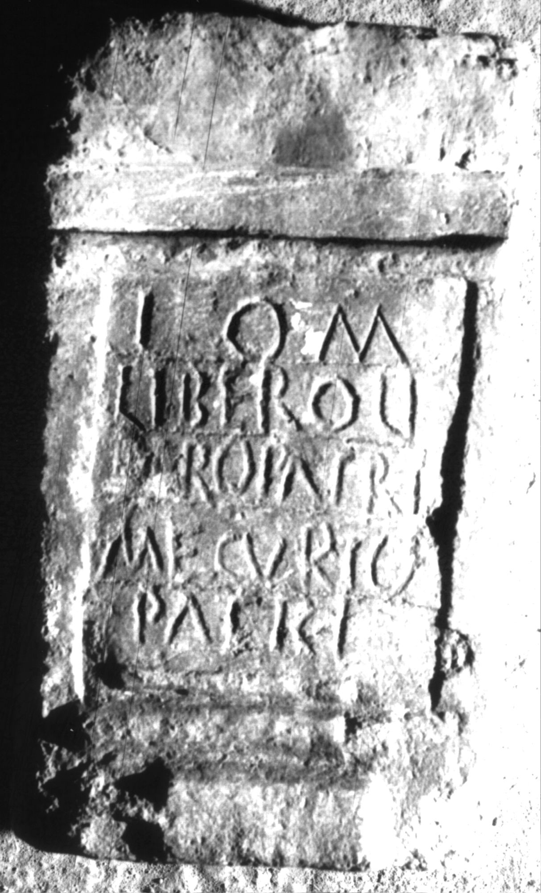

# EDH HD025578. Apulum

**Країна.** Румунія

**Провінція (код EDH).** Dac

**Місце знахідки (антична назва).** Apulum

**Сучасна назва.** Alba Iulia

**Деталі знахідки.** {Partoş}

**Координати.** 46.0463184,23.566650100

**Зберігання.** Alba Iulia, Muz. Unirii

**Датування (роки, від'ємні до н. е.).** 101 … 300

**Матеріал.** Kalkstein

**Тип пам'ятки.** Altar?

**Розміри (висота, ширина, глибина, см).** 25.0 × 15.0 × 11.0

## Текст (латинь, скорочення розкрито)

```
I(ovi) O(ptimo) M(aximo) / {Libero} Li/bero Patri / Me(r)curio / Patri
```

## Текст у вихідному записі

```
I O M / LIBERO LI / BERO PATRI / MECVRIO / PATRI
```

## Коментар

Altar oder Statuenbasis.

## Література

AE 1930, 0009.
- C. Daicoviciu, ACM 1929, 305-306, Nr. 8; fig. 5. - AE 1930.
- IDR 3, 5, 200; Foto. #

## Фото



Джерело https://edh.ub.uni-heidelberg.de/edh/inschrift/HD025578, ліцензія CC BY-SA 4.0. Оригінальний XML в архіві сирі_дані/edh_xml.zip
