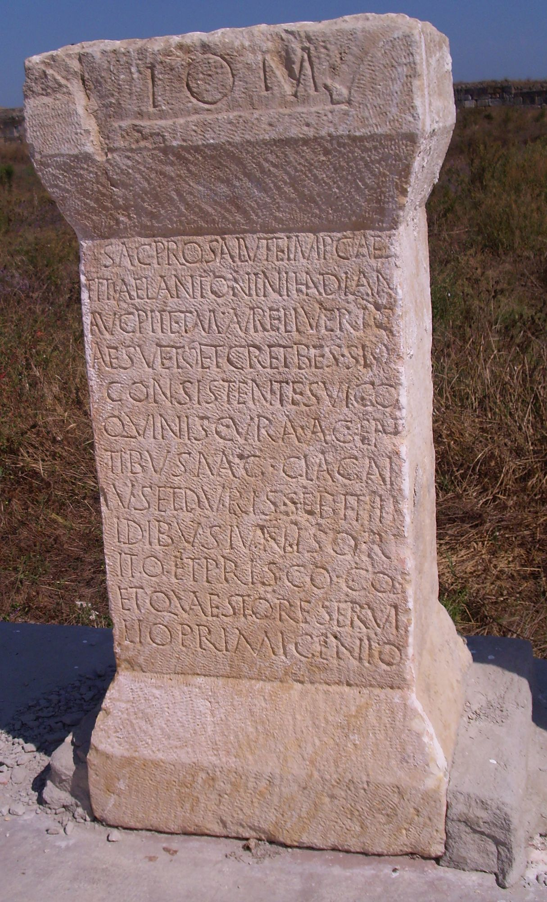

# EDH HD026539. Istrus

**Країна.** Румунія

**Провінція (код EDH).** MoI

**Місце знахідки (антична назва).** Istrus

**Сучасна назва.** Istria

**Деталі знахідки.** spätantike Festung, {Kurtine a}, bei

**Координати.** 44.549316365,28.774523735

**Рік знахідки.** 1916

**Зберігання.** Istria, Muzeul

**Датування (роки, від'ємні до н. е.).** 149 … 

**Матеріал.** Kalkstein

**Тип пам'ятки.** Altar

**Розміри (висота, ширина, глибина, см).** 113.0 × 56.5 × 41.0

## Текст (латинь, скорочення розкрито)

```
I(ovi) O(ptimo) M(aximo) // sac(rum) pro salute Imp(eratoris) Caes(aris) / Titi Ael(i) Antonini Had(r)iani / Aug(usti) Pii et M(arci) Aureli Veri C/aes(aris) vet(erani) et c(ives) R(omani) et Bessi / consistentes vico / Quin(tion)is cura(m) agen/tibus mag(istris) Cla(udio) Gai/us(!) et Durisse Bithi / Idibus Iunis Orf/ito et Prisco co(n)s(ulibus) / et quaestore Servi/lio Primigenio
```

## Текст у вихідному записі

```
I O M / / SAC PRO SALVTE IMP CAES / TITI AEL ANTONINI HADIANI / AVG PII ET M AVRELI VERI C / AES VET ET C R ET BESSI / CONSISTENTES VICO / QVINIS CVRA AGEN / TIBVS MAG CLA GAI / VS ET DVRISSE BITHI / IDIBVS IVNIS ORF / ITO ET PRISCO COS / ET QVAESTORE SERVI / LIO PRIMIGENIO
```

## Література

AE 1924, 0142.
- IScM 1, 326; Foto.
- V. Pârvan, MAR(H) 2, 1924, 55-60, Nr. 46; Zeichnung. - AE 1924.
- S. Lambrino, in: J. Marouzeau (Hrsg.), Mélanges de philologie, de littérature et d'histoire anciennes offerts à J. Marouzeau (Paris 1948) 320-321, Nr. 3.
- PIR (2. Aufl.) C 1447.
- PIR (2. Aufl.) P 603. #

## Фото



Джерело https://edh.ub.uni-heidelberg.de/edh/inschrift/HD026539, ліцензія CC BY-SA 4.0. Оригінальний XML в архіві сирі_дані/edh_xml.zip
