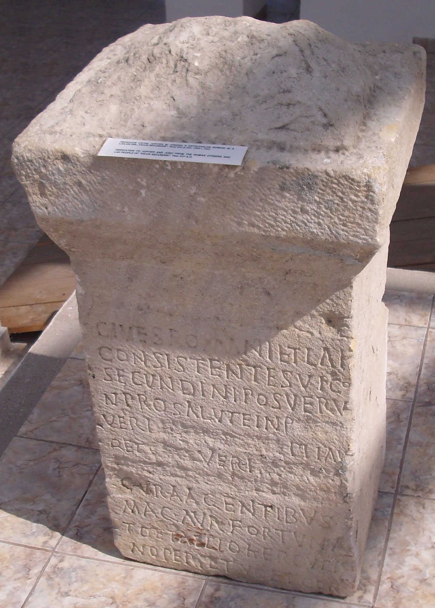
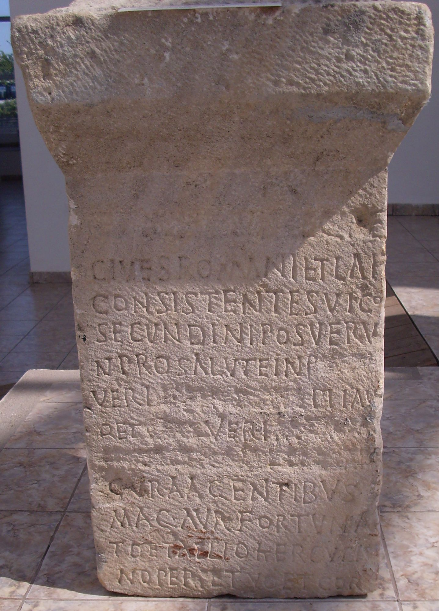

# EDH HD026557. Istrus

**Країна.** Румунія

**Провінція (код EDH).** MoI

**Місце знахідки (антична назва).** Istrus

**Сучасна назва.** Istria

**Деталі знахідки.** spätantike Festung, {Haupttor}, gegenüber, Tal

**Координати.** 44.549316365,28.774523735

**Рік знахідки.** 1916

**Зберігання.** Istria, Muzeul

**Датування (роки, від'ємні до н. е.).** 237 … 

**Матеріал.** Kalkstein

**Тип пам'ятки.** Altar

**Розміри (висота, ширина, глибина, см).** -96.0 × 56.0 × 52.0

## Текст (латинь, скорочення розкрито)

```
[[I(ovi) O(ptimo) M(aximo)]] / [[et Iunoni Reginae]] / cives Romani et Lai / consistentes vico / Secundini posueru/nt pro salute Inp(eratoris)(!) [[[C(ai) Iul(i)]]] / Veri [[[Ma]xim[i]n[i]]] Pii Au/g(usti) et [[[C(ai) Iul(i)] Veri [Maximi]]] / [[[nobilissimi Caesaris]]] / cura agentibus / mag(istris) Aur(elio) Fortuna/to et Aelio Hercula/no Perpetuo et Cor/[neliano co(n)s(ulibus)]
```

## Текст у вихідному записі

```
[[I O M]] / [[ET IVNONI REGINAE]] / CIVES ROMANI ET LAI / CONSISTENTES VICO / SECVNDINI POSVERV / NT PRO SALVTE INP [[[ ]]] / VERI [[[ ]XIM[ ]N[ ]]] PII AV / G ET [[[ ] VERI [ ]]] / [[[ ]]] / CVRA AGENTIBVS / MAG AVR FORTVNA / TO ET AELIO HERCVLA / NO PERPETVO ET COR / [ ]
```

## Література

AE 1924, 0148.
- IScM 1, 346: Foto.
- V. Pârvan, MAR(H) 2, 1924, 96-106, Nr. 61; Zeichnung. - AE 1924.
- S. Lambrino, in: J. Marouzeau (Hrsg.), Mélanges de philologie, de littérature et d'histoire anciennes offerts à J. Marouzeau (Paris 1948) 323-242, Nr. 11.
- PIR (2. Aufl.) M 703.
- PIR (2. Aufl.) M 312. #

## Фото





Джерело https://edh.ub.uni-heidelberg.de/edh/inschrift/HD026557, ліцензія CC BY-SA 4.0. Оригінальний XML в архіві сирі_дані/edh_xml.zip
