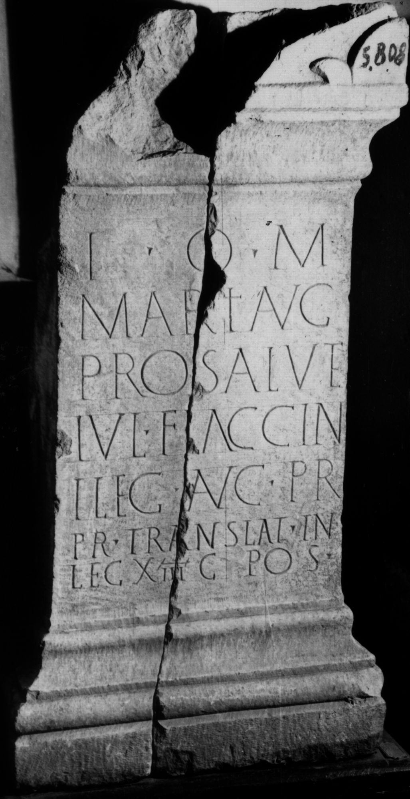

# EDH HD026584. Colonia Ulpia Traiana Sarmizegetusa

**Країна.** Румунія

**Провінція (код EDH).** Dac

**Місце знахідки (антична назва).** Colonia Ulpia Traiana Sarmizegetusa

**Сучасна назва.** Sarmizegetusa

**Координати.** 45.516666699,22.783333299

**Зберігання.** Sarmizegetusa, Muz. Arh.

**Датування (роки, від'ємні до н. е.).** 119 … 168

**Тип пам'ятки.** Altar

**Розміри (висота, ширина, глибина, см).** 86.0 × 44.0 × 34.0

## Текст (латинь, скорочення розкрито)

```
I(ovi) O(ptimo) M(aximo) / Marti Aug(usto) / pro salute / Iul(i) Flaccin/i leg(ati) Aug(usti) pr(o) / pr(aetore) translat(i) in / leg(ionem) XIII g(eminam) pos(uerunt)
```

## Текст у вихідному записі

```
I O M / MARTI AVG / PRO SALVTE / IVL FLACCIN / I LEG AVG PR / PR TRANSLAT IN / LEG XIII G POS
```

## Коментар

In 2 Teile gebrochen. Zeilenlinien für die Beschriftung.

## Література

AE 1934, 0011.
- AE 1939, p. 7 s. n. 5.
- IDR 3, 2, 245; fig. 198 (Foto u. Zeichnung).
- C. Daicoviciu, ACM 4, 1932-1938, 410, Nr. 28; fig. 42. - AE 1987.
- PIR (2. Aufl.) I 310.
- I. Piso, Fasti provinciae Daciae 1. Die senatorischen Amtsträger (Bonn 1993) 77-79, Nr. 19, 1.
- O. Floca, AISC 1, 2, 1928-1932, 54-57. - AE 1934. #

## Фото



Джерело https://edh.ub.uni-heidelberg.de/edh/inschrift/HD026584, ліцензія CC BY-SA 4.0. Оригінальний XML в архіві сирі_дані/edh_xml.zip
