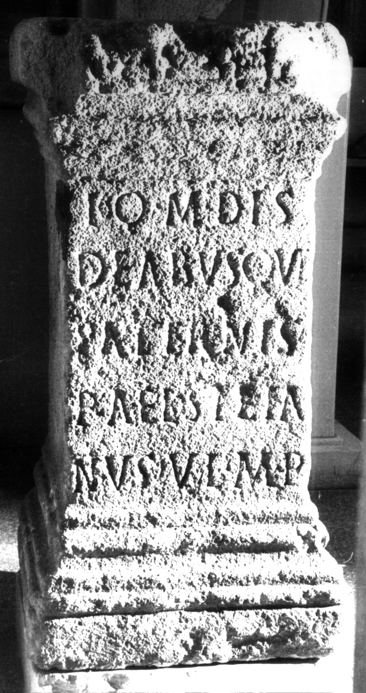

# EDH HD026587. Apulum

**Країна.** Румунія

**Провінція (код EDH).** Dac

**Місце знахідки (антична назва).** Apulum

**Сучасна назва.** Alba Iulia

**Координати.** 46.0669444,23.569999999

**Зберігання.** Cluj-Napoca, Muz. Naţ. Ist. Transilv.

**Датування (роки, від'ємні до н. е.).** 131 … 300

**Матеріал.** Kalkstein

**Тип пам'ятки.** Altar

**Розміри (висота, ширина, глибина, см).** 104.0 × 47.0 × 44.0

## Текст (латинь, скорочення розкрито)

```
I(ovi) O(ptimo) M(aximo) dis / deabusque / paternis / P(ublius) Ael(ius) Stefa/nus v(otum) l(ibens) m(erito) p(osuit)
```

## Текст у вихідному записі

```
I O M DIS / DEABVSQVE / PATERNIS / P AEL STEFA / NVS V L M P
```

## Коментар

Altar oder Statuenbasis. In Z. 1, 4 u. 5: hederae.

## Література

AE 1934, 0012.
- IDR 3, 5, 187; Foto.
- C. Daicoviciu, AISC 1, 2, 1928-1932, 58, Nr. 1a. - AE 1934. #

## Фото



Джерело https://edh.ub.uni-heidelberg.de/edh/inschrift/HD026587, ліцензія CC BY-SA 4.0. Оригінальний XML в архіві сирі_дані/edh_xml.zip
