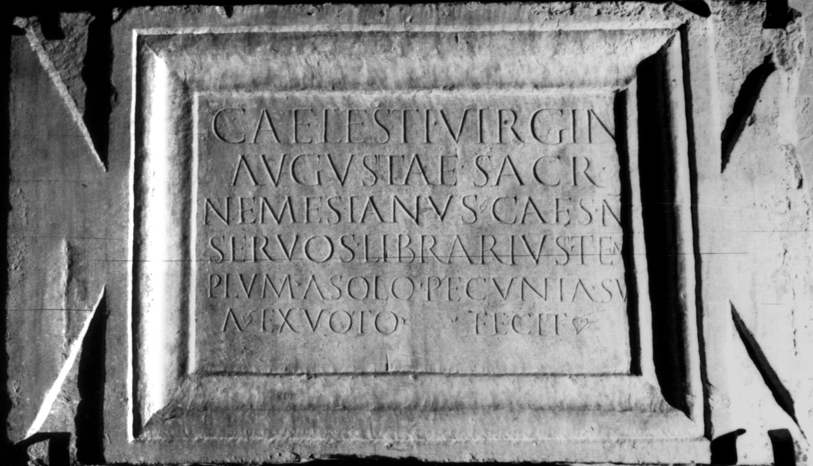

# EDH HD026979. Colonia Ulpia Traiana Sarmizegetusa

**Країна.** Румунія

**Провінція (код EDH).** Dac

**Місце знахідки (антична назва).** Colonia Ulpia Traiana Sarmizegetusa

**Сучасна назва.** Sarmizegetusa

**Координати.** 45.516666699,22.783333299

**Зберігання.** Deva, Muz. Civil. Dac. şi Rom.

**Датування (роки, від'ємні до н. е.).** 107 … 150

**Тип пам'ятки.** Tafel

**Розміри (висота, ширина, глибина, см).** 80.0 × 45.0 × 6.0

## Текст (латинь, скорочення розкрито)

```
Caelesti Virgini / Augustae sacr(um) / Nemesianus Caes(aris) n(ostri) / servos(!) librarius tem/plum a solo <p=R>ecunia#<p>ecunia#RECUNIA su/a ex voto fecit
```

## Текст у вихідному записі

```
CAELESTI VIRGINI / AVGVSTAE SACR / NEMESIANVS CAES N / SERVOS LIBRARIVS TEM / PLVM A SOLO RECVNIA SV / A EX VOTO FECIT
```

## Коментар

Inschriftfeld in Form einer tabula ansata. Hedera am Ende von Z. 6. (B): von Finály; AE 1913; Jánó: Abweichungen in der Lesung.

## Література

AE 1913, 0050. (B)
- AE 1914, p. 2 s. n. 9.
- IDR 3, 2, 017; fig. 13 (Foto u. Zeichnung).
- G. von Finály, AA 1912, 531, Nr. 2. (B) - AE 1913.
- B. Jánó, AErt 32, 1912, 51. (B) - AE 1914. #

## Фото



Джерело https://edh.ub.uni-heidelberg.de/edh/inschrift/HD026979, ліцензія CC BY-SA 4.0. Оригінальний XML в архіві сирі_дані/edh_xml.zip
