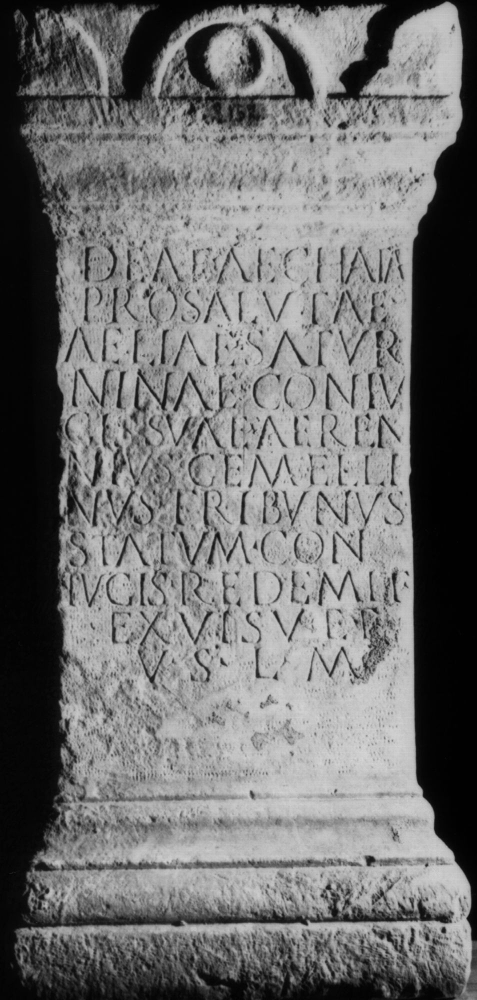
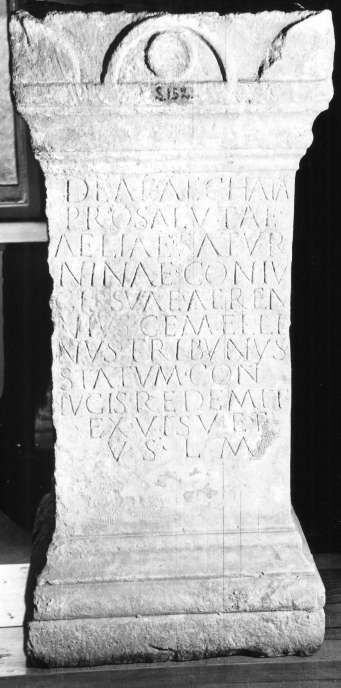

# EDH HD026982. Colonia Ulpia Traiana Sarmizegetusa

**Країна.** Румунія

**Провінція (код EDH).** Dac

**Місце знахідки (антична назва).** Colonia Ulpia Traiana Sarmizegetusa

**Сучасна назва.** Sarmizegetusa

**Координати.** 45.516666699,22.783333299

**Зберігання.** Sarmizegetusa, Muz. Arh.

**Датування (роки, від'ємні до н. е.).** 171 … 200

**Тип пам'ятки.** Altar

**Розміри (висота, ширина, глибина, см).** 102.0 × 46.0 × 37.0

## Текст (латинь, скорочення розкрито)

```
Deae (H)aechatae(!) / pro salutae(!) / Aeliae Satur/ninae coniu/gis suae (H)aeren/nius(!) Gemelli/nus tribunus / statum con/iugis redemit / ex visu et / v(otum) s(olvit) l(ibens) m(erito)
```

## Текст у вихідному записі

```
DEAE AECHATAE / PRO SALVTAE / AELIAE SATVR / NINAE CONIV / GIS SVAE AEREN / NIVS GEMELLI / NVS TRIBVNVS / STATVM CON / IVGIS REDEMIT / EX VISV ET / V S L M
```

## Коментар

Hedera am Ende der Z. 11. (B): von Finály; AE 1913; Jánó; ILS: Z. 4/5: coniugis / suae.

## Література

AE 1913, 0051. (B)
- AE 1914, p. 2 s. n. 9.
- G. von Finály, AA 1912, 531, Nr. 3. (B) - AE 1913.
- B. Jánó, AErt 32, 1912, 51. (B) - AE 1914.
- ILS 9515. (B)
- IDR 3, 2, 220; fig. 176 (Foto u. Zeichnung).
- I. Piso, Fasti provinciae Daciae 1. Die senatorischen Amtsträger (Bonn 1993) 92, Anm. 43. #

## Фото





Джерело https://edh.ub.uni-heidelberg.de/edh/inschrift/HD026982, ліцензія CC BY-SA 4.0. Оригінальний XML в архіві сирі_дані/edh_xml.zip
