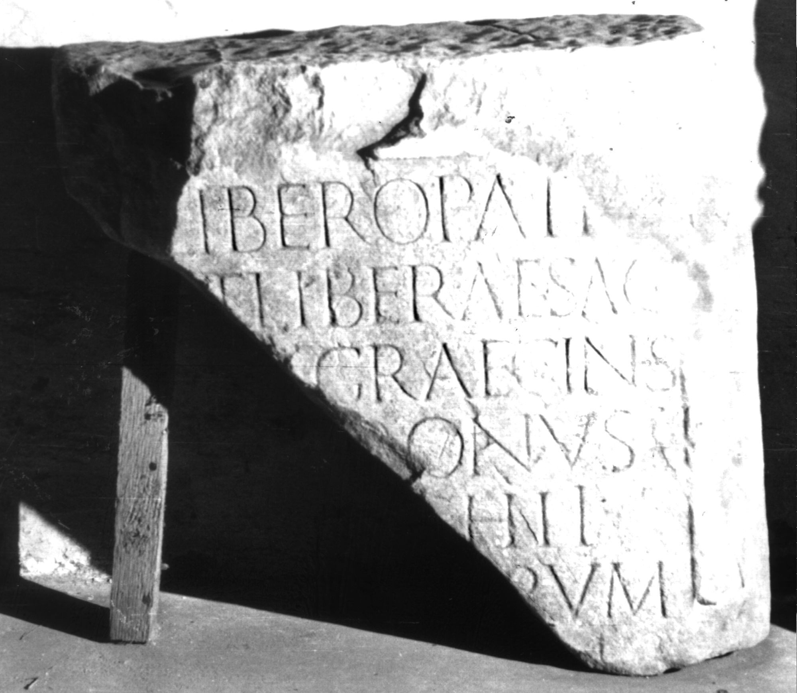

# EDH HD026985. Colonia Ulpia Traiana Sarmizegetusa

**Країна.** Румунія

**Провінція (код EDH).** Dac

**Місце знахідки (антична назва).** Colonia Ulpia Traiana Sarmizegetusa

**Сучасна назва.** Sarmizegetusa

**Координати.** 45.516666699,22.783333299

**Зберігання.** Sarmizegetusa, Muz. Arh.

**Датування (роки, від'ємні до н. е.).** 107 … 150

**Тип пам'ятки.** Tafel

**Розміри (висота, ширина, глибина, см).** -52.0 × -53.0 × 20.0

## Текст (латинь, скорочення розкрито)

```
Libero Patr[i] / [e]t Liberae sacr(um) / [Fla?]v(ius?) Graecinus / [pat]ronus / [de?]c(uriae?) <II=H>II#<II>II#HII / [coll(egii)? fab?]rum / [---]m / [&
```

## Текст у вихідному записі

```
LIBERO PATR[ ] / [ ]T LIBERAE SACR / [ ]V GRAECINVS / [ ]RONVS / [ ]C HII / [ ]RVM / [ ]M / [
```

## Коментар

(B): von Finály; AE 1913; Jánó; IDR III 2: Abweichungen in der Lesung..

## Література

AE 1913, 0052. (B)
- AE 1914, p. 2 s. n. 9.
- G. von Finály, AA 1912, 531, Nr. 4. (B) - AE 1913.
- B. Jánó, AErt 32, 1912, 52. (B) - AE 1914.
- IDR 3, 2, 254; fig. 206 (Foto u. Zeichnung). (B) #

## Фото



Джерело https://edh.ub.uni-heidelberg.de/edh/inschrift/HD026985, ліцензія CC BY-SA 4.0. Оригінальний XML в архіві сирі_дані/edh_xml.zip
