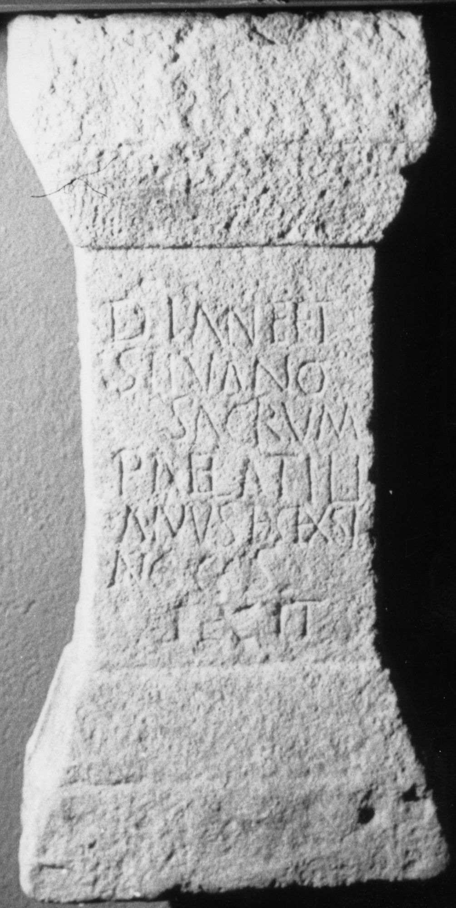
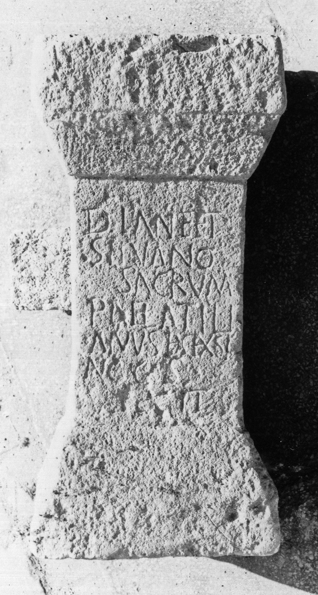

# EDH HD026991. Negrileşti

**Країна.** Румунія

**Провінція (код EDH).** Dac

**Сучасна назва.** Negrileşti

**Координати.** 47.266666699,24.049999999

**Датування (роки, від'ємні до н. е.).** 171 … 250

**Тип пам'ятки.** Altar

**Розміри (висота, ширина, глибина, см).** 60.0 × 20.0 × 25.0

## Текст (латинь, скорочення розкрито)

```
Dian(a)e et / Silvano / sacrum / P(ublius) Ael(ius) Atili/anus dec(urio) ex si/ng(ulari) co(n)s(ularis) / fecit
```

## Текст у вихідному записі

```
DIANE ET / SILVANO / SACRVM / P AEL ATILI / ANVS DEC EX SI / NG COS / FECIT
```

## Література

AE 1913, 0054.
- AE 1914, p. 2 s. n. 9.
- ILD 795.
- G. von Finály, AA 1912, 533. - AE 1913.
- F. Gábor, AErt 31, 1911, 433, Nr. 1; 1. ábr. - AE 1914. #

## Фото





Джерело https://edh.ub.uni-heidelberg.de/edh/inschrift/HD026991, ліцензія CC BY-SA 4.0. Оригінальний XML в архіві сирі_дані/edh_xml.zip
