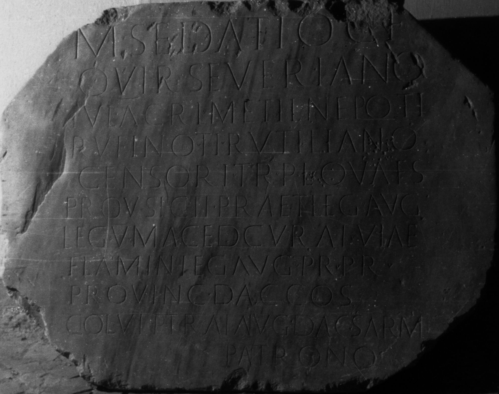

# EDH HD026994. Colonia Ulpia Traiana Sarmizegetusa, aus

**Країна.** Румунія

**Провінція (код EDH).** Dac

**Місце знахідки (антична назва).** Colonia Ulpia Traiana Sarmizegetusa, aus

**Сучасна назва.** Sălişte

**Деталі знахідки.** Săcel, {S. Nicolae, Kirche}, sekundär verwendet

**Координати.** 45.780482830,23.938966591

**Зберігання.** Sibiu, Muz. Brukenthal

**Датування (роки, від'ємні до н. е.).** 153 … 

**Тип пам'ятки.** Tafel

**Розміри (висота, ширина, глибина, см).** -108.0 × -85.0 × -14.0

## Текст (латинь, скорочення розкрито)

```
M(arco) Sedatio C(ai) f(ilio) / Quir(ina) Severiano / Iul(io) Acri Metil(io) Nepoti / Rufino Ti(berio) Rutiliano / Censori tr(ibuno) pl(ebis) quaes(tori) / prov(inciae) Sicil(iae) praet(ori) leg(ato) Aug(usti) / leg(ionis) V Maced(onicae) curat(ori) viae / Flamin(iae) leg(ato) Aug(usti) pr(o) pr(aetore) / provinc(iae) Dac(iae) co(n)s(uli) / col(onia) Ulp(ia) Trai(ana) Aug(usta) Dac(ica) Sarm(izegetusa) / patrono
```

## Текст у вихідному записі

```
M SEDATIO C F / QVIR SEVERIANO / IVL ACRI METIL NEPOTI / RVFINO TI RVTILIANO / CENSORI TR PL QVAES / PROV SICIL PRAET LEG AVG / LEG V MACED CVRAT VIAE / FLAMIN LEG AVG PR PR / PROVINC DAC COS / COL VLP TRAI AVG DAC SARM / PATRONO
```

## Коментар

Datierung: im Jahr des Suffektkonsulats des M. Sedatius Severianus 153 n. Chr. oder bald danach.

## Література

AE 1913, 0055.
- AE 1914, p. 2 s. n. 9.
- IDR 3, 2, 097; fig. 77 (Zeichnung).
- ILS 9487.
- G. von Finály, AA 1912, 533-534; Abb. 1. - AE 1913.
- F. Gábor, AErt 31, 1911, 433-435, Nr. 2; 2. ábr. - AE 1914.
- PIR (2. Aufl.) S 306.
- I. Piso, Fasti provinciae Daciae 1. Die senatorischen Amtsträger (Bonn 1993) 61-66, Nr. 14, 8. #

## Фото



Джерело https://edh.ub.uni-heidelberg.de/edh/inschrift/HD026994, ліцензія CC BY-SA 4.0. Оригінальний XML в архіві сирі_дані/edh_xml.zip
