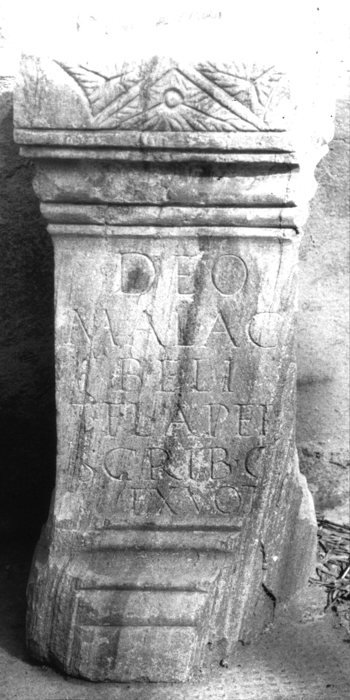

# EDH HD028596. Colonia Ulpia Traiana Sarmizegetusa

**Країна.** Румунія

**Провінція (код EDH).** Dac

**Місце знахідки (антична назва).** Colonia Ulpia Traiana Sarmizegetusa

**Сучасна назва.** Sarmizegetusa

**Координати.** 45.516666699,22.783333299

**Рік знахідки.** 1889

**Зберігання.** Deva, Muz. Civil. Dac. şi Rom.

**Датування (роки, від'ємні до н. е.).** 131 … 200

**Матеріал.** Marmor

**Тип пам'ятки.** Altar

**Розміри (висота, ширина, глибина, см).** 56.0 × -30.0 × 27.0

## Текст (латинь, скорочення розкрито)

```
Deo / Malag/beli / T(itus) Fl(avius) Aper / scrib(a) c[ol(oniae)] / ex vot[o]
```

## Текст у вихідному записі

```
DEO / MALAG / BELI / T FL APER / SCRIB C[ ] / EX VOT[ ]
```

## Коментар

Die Inschrift war bei der Auffindung offenbar noch vollständig erhalten. Z. 5 (Ende): Buchstabe O war kleiner und in das C eingeschrieben; möglicherweise noch ein kleiner Rest erkennbar. (B): Téglás - Király; AE 1890; CIL III; Z. 4 (Anfang): I.(!) Fl. Aper; IDR III: Z. 5/6: col. / ex voto (obwohl auf Foto u. Zeichnung fragmentarisch).

## Література

AE 1912, 0303.
- G. Téglás, ErdélyiMuz 19, 1902, 216-217, Nr. 8. - AE 1912.
- AE 1890, 0100. (B)
- G. Téglás - P. Király, AEM 13, 1890, 192, Nr. 1. (B) - AE 1890.
- CIL 03, 12580. (B)
- IDR 3, 2, 264; fig. 216 (Foto u. Zeichnung). (B) #

## Фото



Джерело https://edh.ub.uni-heidelberg.de/edh/inschrift/HD028596, ліцензія CC BY-SA 4.0. Оригінальний XML в архіві сирі_дані/edh_xml.zip
