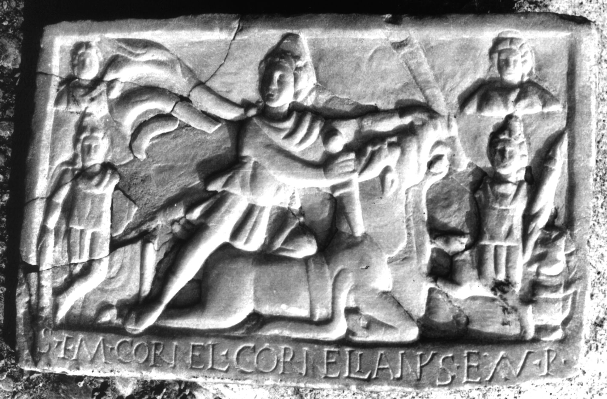

# EDH HD028611. Colonia Ulpia Traiana Sarmizegetusa

**Країна.** Румунія

**Провінція (код EDH).** Dac

**Місце знахідки (антична назва).** Colonia Ulpia Traiana Sarmizegetusa

**Сучасна назва.** Sarmizegetusa

**Координати.** 45.516666699,22.783333299

**Зберігання.** Sarmizegetusa, Muz. Arh.

**Датування (роки, від'ємні до н. е.).** 151 … 270

**Тип пам'ятки.** Relief

**Розміри (висота, ширина, глибина, см).** 30.0 × 48.0 × 4.0

## Текст (латинь, скорочення розкрито)

```
S(oli) I(nvicto) M(ithrae) Cornel(ius) Cornelianus ex v(oto) p(osuit)
```

## Текст у вихідному записі

```
S I M CORNEL CORNELIANVS EX V P
```

## Коментар

Mithrasrelief; die Inschrift befindet sich auf dem unteren Rahmen. (B): Téglás; AE 1912: Cornel(ius) Corneli(an)u(s).

## Література

AE 1912, 0308. (B)
- IDR 3, 2, 279; fig. 230.
- CIL 03, 12581.
- G. Téglás, ErdélyiMuz 19, 1902, 273-274. (B) - AE 1912. #

## Фото



Джерело https://edh.ub.uni-heidelberg.de/edh/inschrift/HD028611, ліцензія CC BY-SA 4.0. Оригінальний XML в архіві сирі_дані/edh_xml.zip
