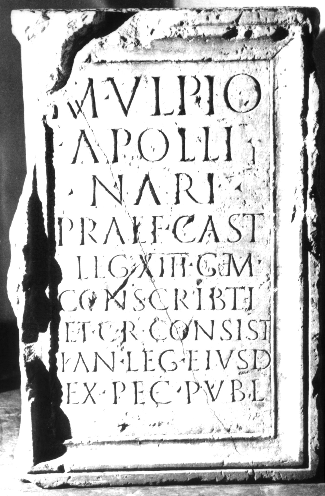

# EDH HD029700. Apulum

**Країна.** Румунія

**Провінція (код EDH).** Dac

**Місце знахідки (антична назва).** Apulum

**Сучасна назва.** Alba Iulia

**Деталі знахідки.** Festung, {S. Michael, katholische Kathedrale}, sekundär verwendet

**Координати.** 46.067648088,23.569900989

**Зберігання.** Alba Iulia, Muz. Unirii

**Датування (роки, від'ємні до н. е.).** 117 … 200

**Матеріал.** Marmor

**Тип пам'ятки.** Statuenbasis

**Розміри (висота, ширина, глибина, см).** 100.0 × 60.0 × 60.0

## Текст (латинь, скорочення розкрито)

```
M(arco) Ulpio / Apolli/nari / praef(ecto) cast(rorum) / leg(ionis) XIII gem(inae) / conscribti(!) / et c(ives) R(omani) consist(entes) / kan(nabis) leg(ionis) eiusd(em) / ex pec(unia) publ(ica)
```

## Текст у вихідному записі

```
M VLPIO / APOLLI / NARI / PRAEF CAST / LEG XIII GEM / CONSCRIBTI / ET C R CONSIST / KAN LEG EIVSD / EX PEC PVBL
```

## Коментар

Mittelteil einer Statuenbasis.

## Література

AE 1910, 0084.
- AE 1910, p. 36 s. n. 140.
- ILS 9106.
- IDR 3, 5, 438; Foto.
- J. Jung, JŒAI (Beibl.) 12, 1910, 139-146; fig. 102. - AE 1910, 0084.
- B. Cserni, AErt 29, 1909, 269-271; Foto. - AE 1910, p. 36 s. n. 140. #

## Фото



Джерело https://edh.ub.uni-heidelberg.de/edh/inschrift/HD029700, ліцензія CC BY-SA 4.0. Оригінальний XML в архіві сирі_дані/edh_xml.zip
