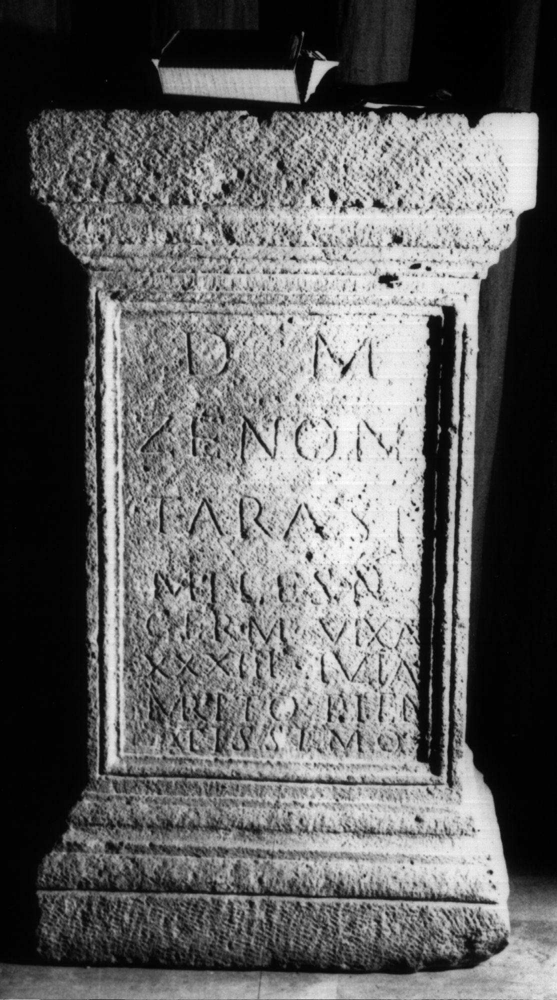

# EDH HD029892. Apulum

**Країна.** Румунія

**Провінція (код EDH).** Dac

**Місце знахідки (антична назва).** Apulum

**Сучасна назва.** Alba Iulia

**Деталі знахідки.** Dealul Furcilor, Römische Nekropole

**Координати.** 46.058289976,23.571558846

**Рік знахідки.** 1909

**Зберігання.** Alba Iulia, Muz. Unirii

**Датування (роки, від'ємні до н. е.).** 131 … 230

**Матеріал.** Sandstein

**Тип пам'ятки.** Statuenbasis

**Розміри (висота, ширина, глибина, см).** 130.0 × 74.0 × 54.0

## Текст (латинь, скорочення розкрито)

```
D(is) M(anibus) / Zenon / Tarasi / miles n(umeri) / Germ(anicianorum) vix(it) an(nos) / XXXIII Iulia / marito pien/tissimo
```

## Текст у вихідному записі

```
D M / ZENON / TARASI / MILES N / GERM VIX AN / XXXIII IVLIA / MARITO PIEN / TISSIMO
```

## Коментар

(B): Csernî; AE 1910; Gostar, Germania; Gostar, ActaMusNapoca: Leseabweichungen.

## Література

AE 1972, 0487, 2.
- AE 1910, 0152. (B)
- IDR 3, 5, 615; Foto u. Zeichnung.
- N. Gostar, ActaMusNapoca 6, 1969, 496-498, Nr. 4, 2. (B) - AE 1972.
- N. Gostar, Germania 50, 1972, 243-244, Nr. 2. (B) - AE 1972.
- B. Csernî, AErt 30, 1910, 178-181; Foto. (B) - AE 1910.
- C. Ciongradi, Grabmonument und sozialer Status in Oberdakien (Cluj-Napoca 2007) 208, Nr. B/A 1; Taf. 64. #

## Фото



Джерело https://edh.ub.uni-heidelberg.de/edh/inschrift/HD029892, ліцензія CC BY-SA 4.0. Оригінальний XML в архіві сирі_дані/edh_xml.zip
