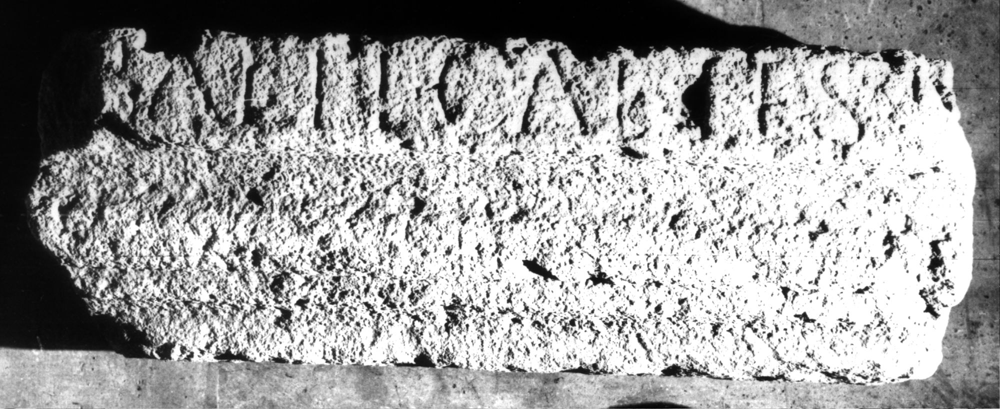

# EDH HD030885. Apulum

**Країна.** Румунія

**Провінція (код EDH).** Dac

**Місце знахідки (антична назва).** Apulum

**Сучасна назва.** Alba Iulia

**Деталі знахідки.** {Partoş}

**Координати.** 46.0463184,23.566650100

**Зберігання.** Alba Iulia, Muz. Unirii

**Датування (роки, від'ємні до н. е.).** 107 … 270

**Матеріал.** Kalkstein

**Тип пам'ятки.** Architekturteil

**Розміри (висота, ширина, глибина, см).** -22.0 × -67.0 × 36.0

## Текст (латинь, скорочення розкрито)

```
Balti Caelest[i ---]
```

## Текст у вихідному записі

```
BALTI CAELEST[ ]
```

## Коментар

Fragment eines Architravs.

## Література

AE 1903, 0058.
- ILS 9281.
- IDR 3, 5, 038; Foto u. Zeichnung.
- R. Münsterberg - J. Oelhler, JŒAI (Beibl.) 5, 1902, 113-114. - AE 1903. #

## Фото



Джерело https://edh.ub.uni-heidelberg.de/edh/inschrift/HD030885, ліцензія CC BY-SA 4.0. Оригінальний XML в архіві сирі_дані/edh_xml.zip
