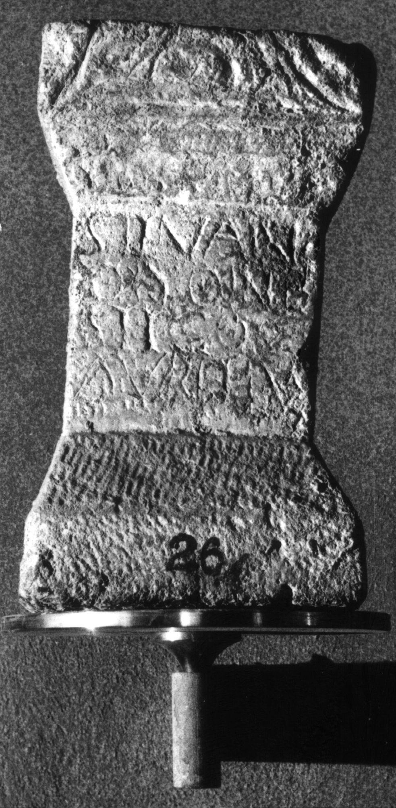

# EDH HD030891. Apulum

**Країна.** Румунія

**Провінція (код EDH).** Dac

**Місце знахідки (антична назва).** Apulum

**Сучасна назва.** Alba Iulia

**Координати.** 46.0669444,23.569999999

**Зберігання.** Alba Iulia, Muz. Unirii

**Датування (роки, від'ємні до н. е.).** 161 … 300

**Матеріал.** Kalkstein

**Тип пам'ятки.** Altar

**Розміри (висота, ширина, глибина, см).** 35.5 × 20.0 × 17.0

## Текст (латинь, скорочення розкрито)

```
Silvan/o Doine/stico(!) / Aurelius
```

## Текст у вихідному записі

```
SILVAN / O DOINE / STICO / AVRELIVS
```

## Коментар

Z. 3 (Ende): hedera. (B): Münsterberg - Oehler; AE 1903: Z. 2/3: Dome/stico.

## Література

AE 1903, 0060. (B)
- R. Münsterberg - J. Oehler, JŒAI (Beibl.) 5, 1902, 115, Nr. 7; Zeichnung. (B) - AE 1903.
- IDR 3, 5, 337; Foto u. Zeichnung. #

## Фото



Джерело https://edh.ub.uni-heidelberg.de/edh/inschrift/HD030891, ліцензія CC BY-SA 4.0. Оригінальний XML в архіві сирі_дані/edh_xml.zip
