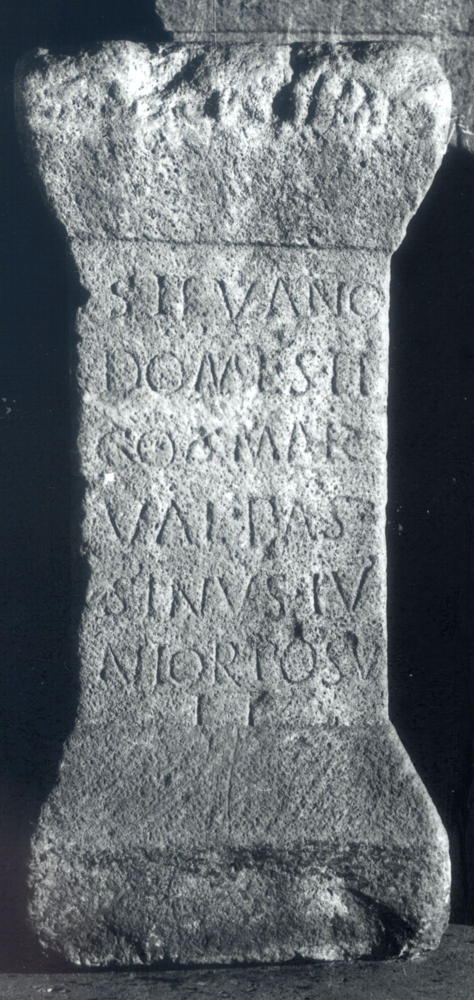

# EDH HD030894. Apulum

**Країна.** Румунія

**Провінція (код EDH).** Dac

**Місце знахідки (антична назва).** Apulum

**Сучасна назва.** Alba Iulia

**Деталі знахідки.** Festung, {Legionslager}, bei

**Координати.** 46.068086754,23.571816338

**Рік знахідки.** 1901

**Зберігання.** Alba Iulia, Muz. Unirii

**Датування (роки, від'ємні до н. е.).** 151 … 270

**Матеріал.** Kalkstein

**Тип пам'ятки.** Altar?

**Розміри (висота, ширина, глибина, см).** 62.0 × 29.0 × 23.0

## Текст (латинь, скорочення розкрито)

```
Silvano Domesti/co Mar(cus) / Val(erius) Bass/{s}inus Iu/nior posu/it
```

## Текст у вихідному записі

```
SILVANO DOMESTI / CO MAR / VAL BASS / SINVS IV / NIOR POSV / IT
```

## Коментар

Altar oder Statuenbasis. Z. 3: hedera. (B): Münsterberg - Oehler; AE 1903: Z.. 4/5: Bas/sinus.

## Література

AE 1903, 0061. (B)
- R. Münsterberg - J. Oehler, JŒAI (Beibl.) 5, 1902, 115-116, Nr. 8; Zeichnung. (B) - AE 1903.
- IDR 3, 5, 342; Foto u. Zeichnung. #

## Фото



Джерело https://edh.ub.uni-heidelberg.de/edh/inschrift/HD030894, ліцензія CC BY-SA 4.0. Оригінальний XML в архіві сирі_дані/edh_xml.zip
