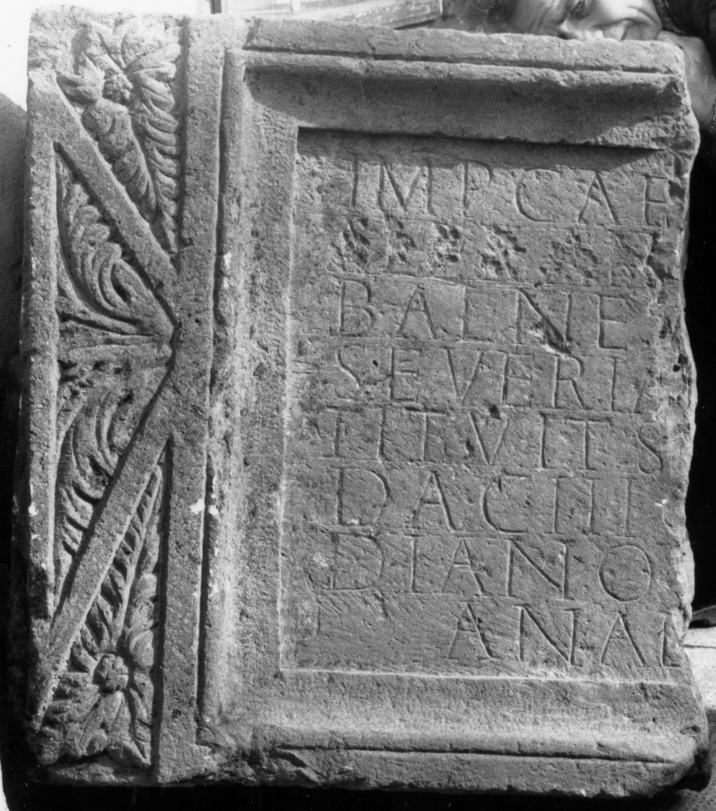
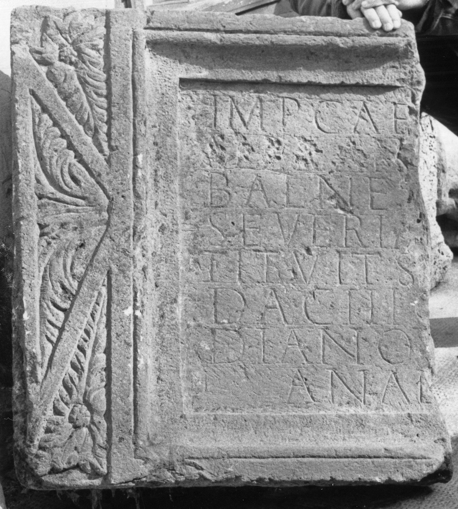

# EDH HD030909. Micia

**Країна.** Румунія

**Провінція (код EDH).** Dac

**Місце знахідки (антична назва).** Micia

**Сучасна назва.** Veţel

**Деталі знахідки.** {Thermen}

**Координати.** 45.914664689,22.815020084

**Рік знахідки.** 1901

**Зберігання.** Deva, Muz. Civil. Dac. şi Rom.

**Датування (роки, від'ємні до н. е.).** 222 … 235

**Матеріал.** Kalkstein

**Тип пам'ятки.** Tafel

**Розміри (висота, ширина, глибина, см).** 86.0 × -76.0 × 21.0

## Текст (латинь, скорочення розкрито)

```
Imp(erator) Cae[s(ar) M(arcus) Aurel(ius) Severus] / [[Alexan[der]] Pius Felix Augustus] / balnea[s coh(ortis) II Fl(aviae) Commagenor(um)] / Severia[nae vetust(ate) dilapsas res]/tituit s[ub --- co(n)s(ulari)] / Dac(iarum) III c[urante ---]/diano p[raef(ecto) coh(ortis) II Fl(aviae) Com(magenorum) Severi]/anae [Alexandrianae]
```

## Текст у вихідному записі

```
IMP CAE[ ] / [[ALEXAN[ ]]] / BALNEA[ ] / SEVERIA[ ] / TITVIT S[ ] / DAC III C[ ] / DIANO P[ ] / ANAE [ ]
```

## Коментар

Tabula ansata; rekonstruierte Breite: circa 220-230 cm. Zeilenlinien für die Beschriftung. (B): Münsterberg - Oehler; AE 1903; IDR III: Leseabweichungen.

## Література

AE 1903, 0066. (B)
- IDR 3, 3, 046; fig. 34 (Foto u. Zeichnung). (B)
- R. Münsterberg - J. Oehler, JŒAI (Beibl.) 5, 1902, 129-130; Zeichnung. (B) - AE 1903. #

## Фото





Джерело https://edh.ub.uni-heidelberg.de/edh/inschrift/HD030909, ліцензія CC BY-SA 4.0. Оригінальний XML в архіві сирі_дані/edh_xml.zip
