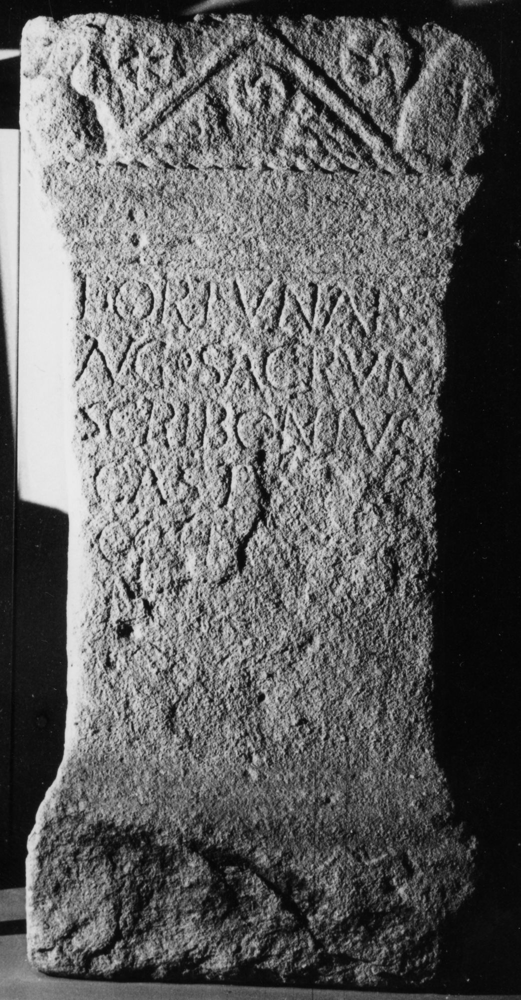

# EDH HD030912. Micia

**Країна.** Румунія

**Провінція (код EDH).** Dac

**Місце знахідки (антична назва).** Micia

**Сучасна назва.** Veţel

**Деталі знахідки.** {Micia}

**Координати.** 45.914556455,22.816629409

**Зберігання.** Deva, Muz. Civil. Dac. şi Rom.

**Датування (роки, від'ємні до н. е.).** 151 … 250

**Тип пам'ятки.** Altar

**Розміри (висота, ширина, глибина, см).** 106.0 × 52.0 × 44.0

## Текст (латинь, скорочення розкрито)

```
Fortunae / Aug(ustae) sacrum / Scribonius / Castu[s praef(ectus)] / coh(ortis) I[I Fl(aviae) Com]/m[agenorum ---] / [------](?)
```

## Текст у вихідному записі

```
FORTVNAE / AVG SACRVM / SCRIBONIVS / CASTV[ ] / COH I[ ] / M[ ] / [ ]
```

## Коментар

Hederae. (B): AE 1903: Z. 5/6: Com]/[magenorum.

## Література

AE 1903, 0067. (B)
- IDR 3, 3, 068; fig. 55 (Foto u. Zeichnung).
- R. Münsterberg - J. Oehler, JŒAI (Beibl.) 5, 1902, 130-131, Nr. 2; Zeichnung. - AE 1903. #

## Фото



Джерело https://edh.ub.uni-heidelberg.de/edh/inschrift/HD030912, ліцензія CC BY-SA 4.0. Оригінальний XML в архіві сирі_дані/edh_xml.zip
