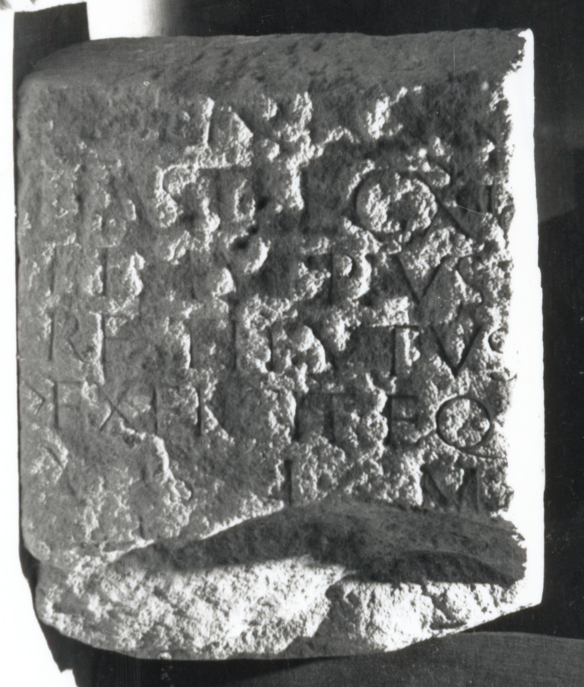

# EDH HD032367. Apulum

**Країна.** Румунія

**Провінція (код EDH).** Dac

**Місце знахідки (антична назва).** Apulum

**Сучасна назва.** Alba Iulia

**Деталі знахідки.** Festung, {Báthory-Kirche}, sekundär verwendet

**Координати.** 46.068786971,23.571510313

**Рік знахідки.** 1898

**Зберігання.** Alba Iulia, Muz. Unirii

**Датування (роки, від'ємні до н. е.).** 107 … 275

**Матеріал.** Kalkstein

**Тип пам'ятки.** Altar?

**Розміри (висота, ширина, глибина, см).** -60.0 × -48.0 × -36.0

## Текст (латинь, скорочення розкрито)

```
$] / [--] LIVI[---] / hast(atus) leg(ionis) XIII g(eminae) / et M(arcus) Ulpius / Restitutus / |(centurio) exercit(ator) eq(uitum) / v(otum) s(olverunt) l(ibentes) m(erito)
```

## Текст у вихідному записі

```
] / [ ] LIVI[ ] / HAST LEG XIII G / ET M VLPIVS / RESTITVTVS / | EXERCIT EQ / V S L M
```

## Коментар

Aus dem Mittelteil eines Altars oder einer Statuenbasis geschnittener Block; (B) CIL III; Jung; AE 1901: abweichende / unvollständige Lesung.

## Література

AE 1901, 0030. (B)
- J. Jung, JŒAI (Beibl.) 3, 1900, 187-188, Nr. 12; fig. 29. - AE 1901. (B)
- CIL 03, 14477.
- IDR 3, 5, 401; Foto u. Zeichnung. #

## Фото



Джерело https://edh.ub.uni-heidelberg.de/edh/inschrift/HD032367, ліцензія CC BY-SA 4.0. Оригінальний XML в архіві сирі_дані/edh_xml.zip
