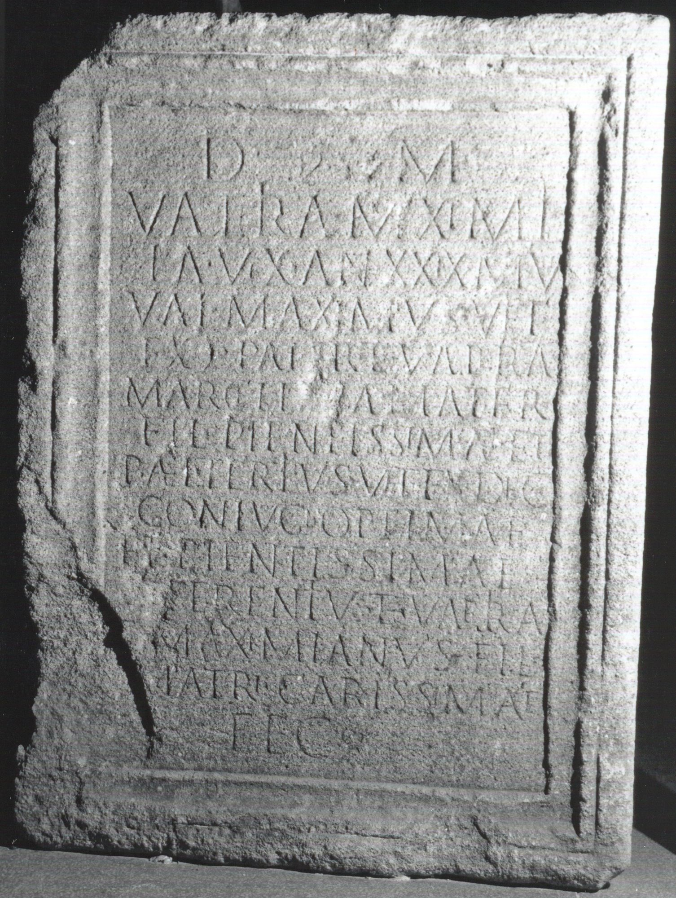
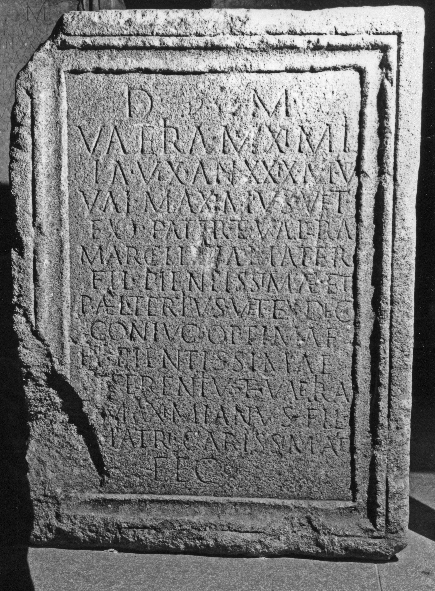

# EDH HD034873. Potaissa

**Країна.** Румунія

**Провінція (код EDH).** Dac

**Місце знахідки (антична назва).** Potaissa

**Сучасна назва.** Turda

**Деталі знахідки.** {Lager}, nordöstlich, "Szindi-völgytető"

**Координати.** 46.570662610,23.772697448

**Рік знахідки.** 1909

**Зберігання.** Cluj-Napoca, Muz. Naţ. Ist. Transilv.

**Датування (роки, від'ємні до н. е.).** 201 … 270

**Матеріал.** Sandstein

**Тип пам'ятки.** Altar

**Розміри (висота, ширина, глибина, см).** 104.0 × 95.0 × 70.0

## Текст (латинь, скорочення розкрито)

```
D(is) M(anibus) / Valeria Maximil/la vix(it) an(nos) XXIX m(enses) VII / Val(erius) Maximus vet(eranus) / ex |(centurione)(?) pater et Valer[i]a / Marcell[in]a mater / fil(iae) pientissimae et / P(ublius) Ael(ius) Tertius vet(eranus) ex dec(urione) / coniugi optimae / et pientissimae / et Terentius et Valeria / [et] Maximianus fil(ii) / matri carissimae / fec(erunt)
```

## Текст у вихідному записі

```
D M / VALERIA MAXIMIL / LA VIX AN XXIX M VII / VAL MAXIMVS VET / EX | PATER ET VALER[ ]A / MARCELL[ ]A MATER / FIL PIENTISSIMAE ET / P AEL TERTIVS VET EX DEC / CONIVGI OPTIMAE / ET PIENTISSIMAE / ET TERENTIVS ET VALERIA / [ ] MAXIMIANVS FIL / MATRI CARISSIMAE / FEC
```

## Коментар

Erhalten ist ein Fragment vom Mittelteil; auf der linken Nebenseite eine Amphore, auf der rechten eine Dienerin(?). Hedera in Z. 1 u. 14; zahlreiche Ligaturen. (B): Schallmayer - Eibl - Ott - Preuss - Wittkopf; ILD: Leseabweichungen.

## Література

ILD 511; Zeichnung. (B)
- E. Schallmayer - K. Eibl - J. Ott - G. Preuß - E. Wittkopf, Der römische Weihebezirk von Osterburken 1 (Stuttgart 1990) 425-426, Nr. 557. (B) #

## Фото





Джерело https://edh.ub.uni-heidelberg.de/edh/inschrift/HD034873, ліцензія CC BY-SA 4.0. Оригінальний XML в архіві сирі_дані/edh_xml.zip
