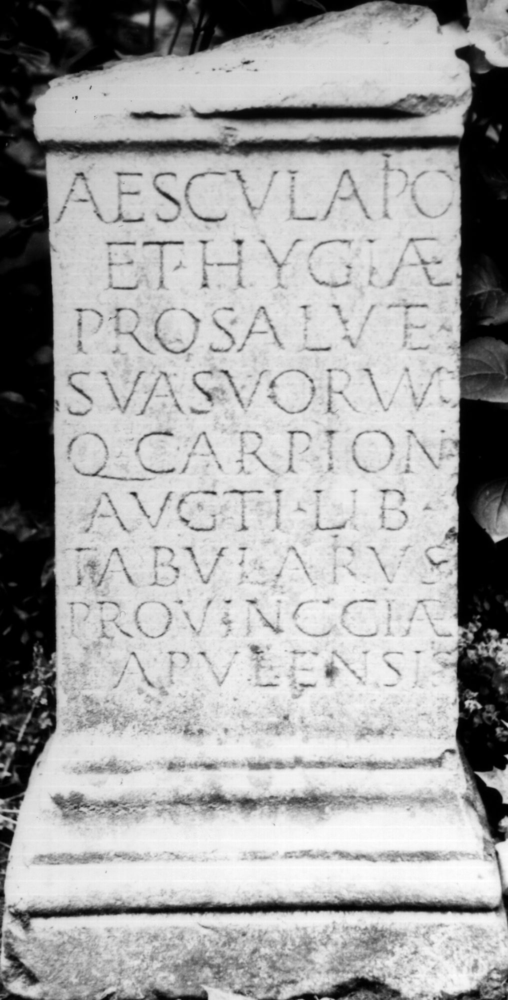
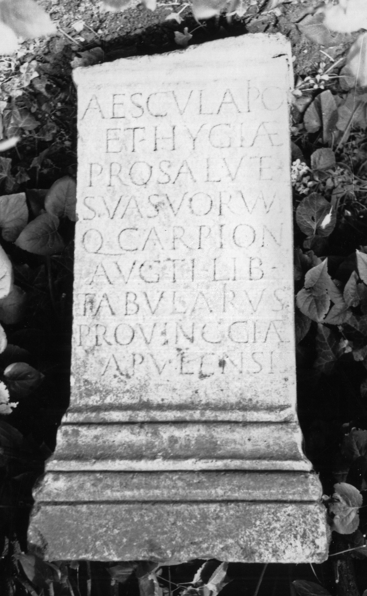

# EDH HD037980. Apulum

**Країна.** Румунія

**Провінція (код EDH).** Dac

**Місце знахідки (антична назва).** Apulum

**Сучасна назва.** Alba Iulia

**Координати.** 46.0669444,23.569999999

**Зберігання.** Alba Iulia, katholischer Bischofssitz

**Датування (роки, від'ємні до н. е.).** 168 … 275

**Матеріал.** Marmor

**Тип пам'ятки.** Altar?

**Розміри (висота, ширина, глибина, см).** 70.0 × 40.0 × 24.0

## Текст (латинь, скорочення розкрито)

```
Aesculapio / et Hygiae / pro salute / sua suorum/q(ue) Carpion / Aug(us)ti lib(ertus) / tabularius / provinc{c}iae / Apulensis
```

## Текст у вихідному записі

```
AESCVLAPIO / ET HYGIAE / PRO SALVTE / SVA SVORVM / Q CARPION / AVGTI LIB / TABVLARIVS / PROVINCCIAE / APVLENSIS
```

## Коментар

Altar oder Statuenbasis.

## Література

IDR 3, 5, 010; Foto.
- CIL 03, 00980. #

## Фото





Джерело https://edh.ub.uni-heidelberg.de/edh/inschrift/HD037980, ліцензія CC BY-SA 4.0. Оригінальний XML в архіві сирі_дані/edh_xml.zip
