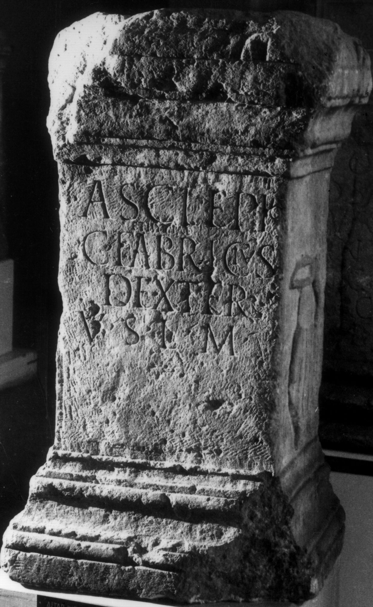
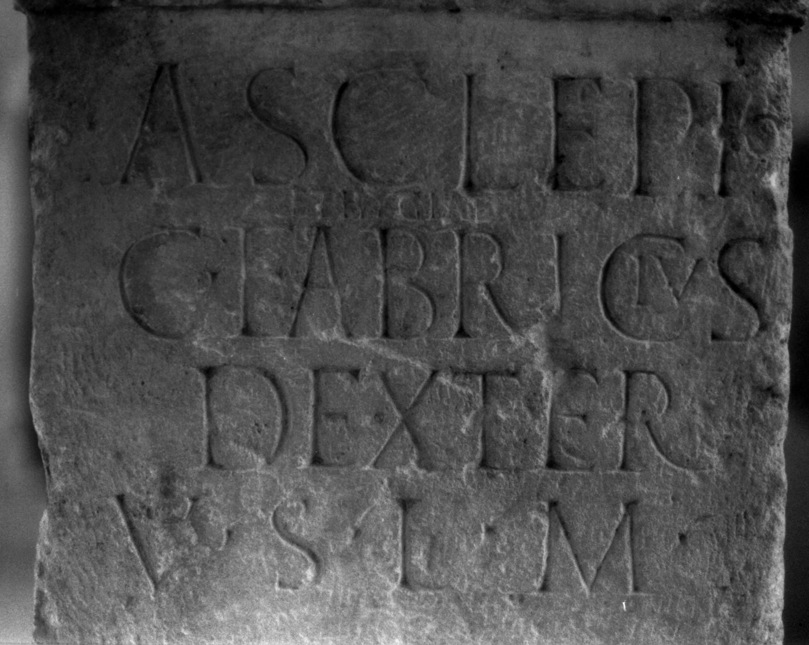
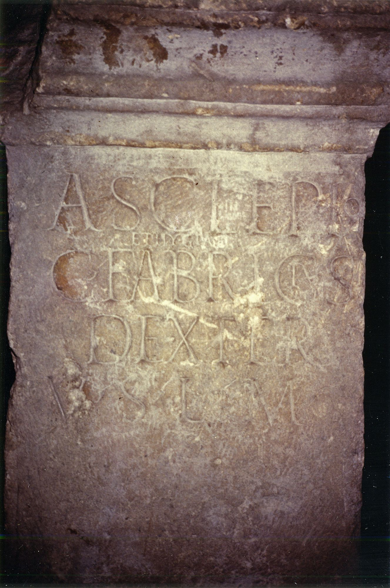

# EDH HD037982. Apulum

**Країна.** Румунія

**Провінція (код EDH).** Dac

**Місце знахідки (антична назва).** Apulum

**Сучасна назва.** Alba Iulia

**Деталі знахідки.** {Partoş}

**Координати.** 46.0463184,23.566650100

**Зберігання.** Cluj-Napoca, Muz. Naţ. Ist. Transilv.

**Датування (роки, від'ємні до н. е.).** 151 … 270

**Матеріал.** Kalkstein

**Тип пам'ятки.** Altar

**Розміри (висота, ширина, глибина, см).** 90.0 × 50.0 × 38.0

## Текст (латинь, скорочення розкрито)

```
Asclepio / et Hygiae / C(aius) Fabricius / Dexter / v(otum) s(olvit) l(ibens) m(erito)
```

## Текст у вихідному записі

```
ASCLEPIO / ET HYGIAE / C FABRICIVS / DEXTER / V S L M
```

## Коментар

Hederae in Z. 5.

## Література

IDR 3, 5, 012; Foto.
- CIL 03, 07740. #

## Фото







Джерело https://edh.ub.uni-heidelberg.de/edh/inschrift/HD037982, ліцензія CC BY-SA 4.0. Оригінальний XML в архіві сирі_дані/edh_xml.zip
