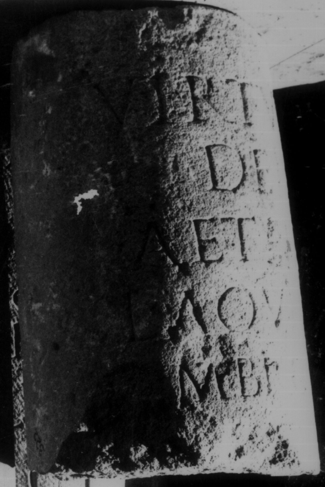

# EDH HD037994. Apulum

**Країна.** Румунія

**Провінція (код EDH).** Dac

**Місце знахідки (антична назва).** Apulum

**Сучасна назва.** Alba Iulia

**Деталі знахідки.** {Festung}

**Координати.** 46.068288248,23.571209907

**Рік знахідки.** 1857

**Зберігання.** Alba Iulia, Muz. Unirii

**Датування (роки, від'ємні до н. е.).** 131 … 250

**Матеріал.** Kalkstein

**Тип пам'ятки.** EhrenVotivsäule

**Розміри (висота, ширина, глибина, см).** 59.0 × 38.0

## Текст (латинь, скорочення розкрито)

```
Virtutib(us) / deii / Aeterni / L(ucius) Aquila / Ambrosius / posuit
```

## Текст у вихідному записі

```
VIRTVTIB / DEII / AETERNI / L AQVILA / AMBROSIVS / POSVIT
```

## Література

IDR 3, 5, 023; Foto u. Zeichnung.
- CIL 03, 00988, 1. #

## Фото



Джерело https://edh.ub.uni-heidelberg.de/edh/inschrift/HD037994, ліцензія CC BY-SA 4.0. Оригінальний XML в архіві сирі_дані/edh_xml.zip
