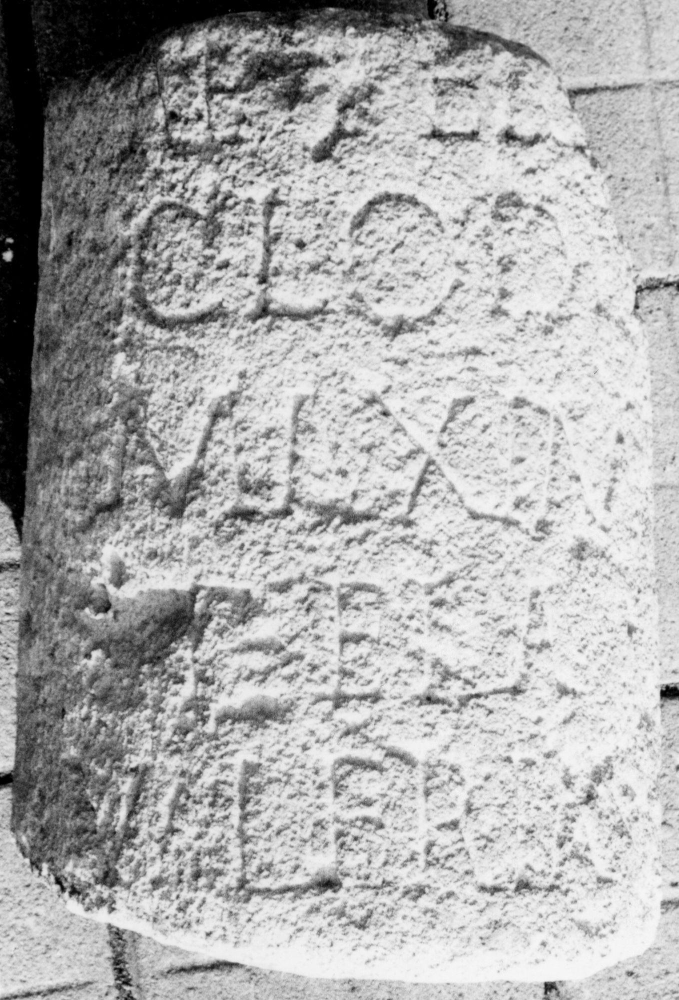

# EDH HD038002. Apulum

**Країна.** Румунія

**Провінція (код EDH).** Dac

**Місце знахідки (антична назва).** Apulum

**Сучасна назва.** Alba Iulia

**Деталі знахідки.** {Partoş}

**Координати.** 46.0463184,23.566650100

**Рік знахідки.** 1870

**Зберігання.** Sibiu, Muz. Brukenthal

**Датування (роки, від'ємні до н. е.).** 151 … 270

**Матеріал.** Kalkstein

**Тип пам'ятки.** EhrenVotivsäule

**Розміри (висота, ширина, глибина, см).** -37.0 × 27.0

## Текст (латинь, скорочення розкрито)

```
$] / Aetern[o] / Clodia / Maxima / [e]t <F=E>la(via)#<F>la(via)#ELA / Valeria / [&
```

## Текст у вихідному записі

```
] / AETERN[ ] / CLODIA / MAXIMA / [ ]T ELA / VALERIA / [
```

## Література

IDR 3, 5, 026; Foto u. Zeichnung.
- CIL 03, 07737. #

## Фото



Джерело https://edh.ub.uni-heidelberg.de/edh/inschrift/HD038002, ліцензія CC BY-SA 4.0. Оригінальний XML в архіві сирі_дані/edh_xml.zip
