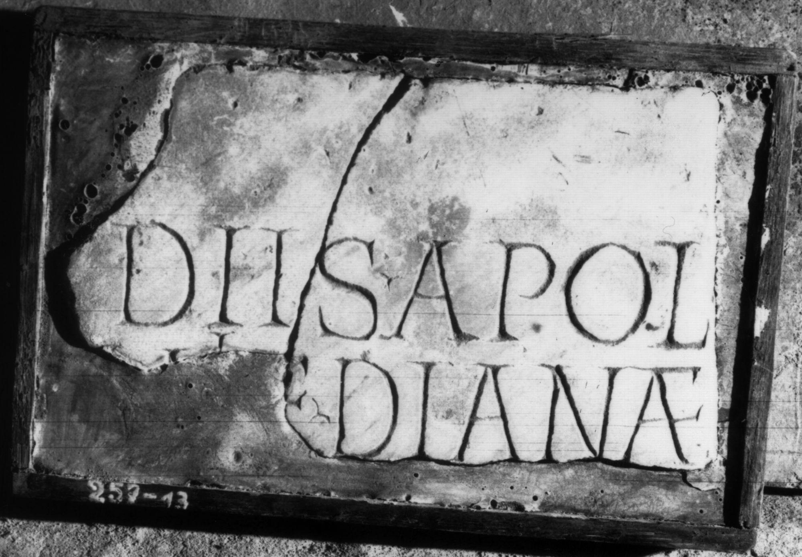
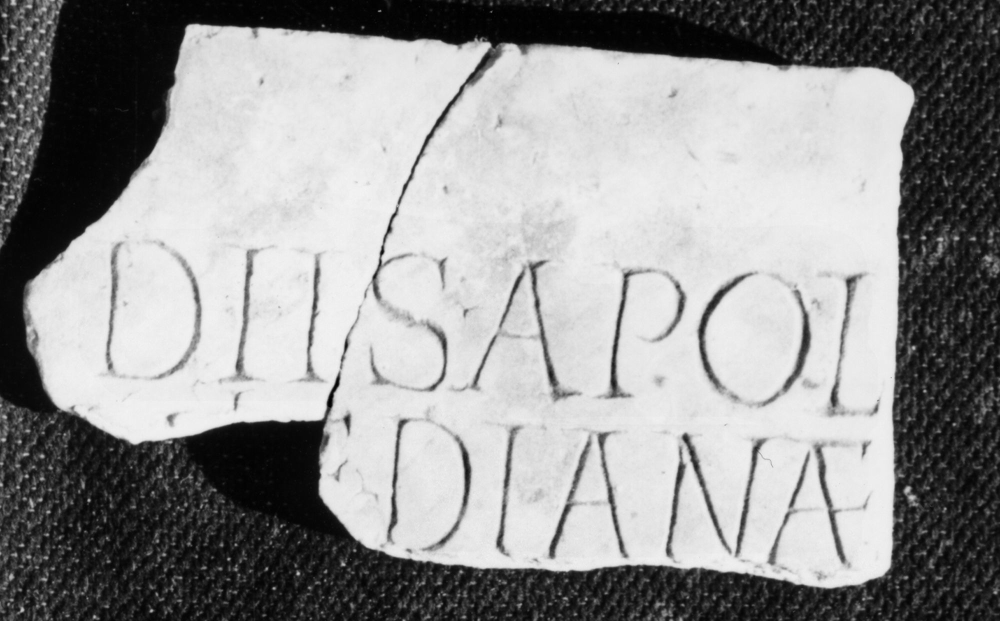

# EDH HD038009. Apulum

**Країна.** Румунія

**Провінція (код EDH).** Dac

**Місце знахідки (антична назва).** Apulum

**Сучасна назва.** Alba Iulia

**Деталі знахідки.** {Festung} - {Partoş}, zwischen

**Координати.** 46.064655616,23.570480346

**Зберігання.** Alba Iulia, Muz. Unirii

**Датування (роки, від'ємні до н. е.).** 201 … 275

**Матеріал.** Marmor

**Тип пам'ятки.** Tafel

**Розміри (висота, ширина, глибина, см).** -7.0 × 19.0 × 2.5

## Текст (латинь, скорочення розкрито)

```
Diis Apol/l[i]ni et Dianae / [&
```

## Текст у вихідному записі

```
DIIS APOL / L[ ]NI ET DIANAE / [
```

## Коментар

Tafel in drei Fragmente gebrochen, eines davon heute verschollen.

## Література

IDR 3, 5, 035; Foto u. Zeichnung.
- CIL 03, 14470. #

## Фото





Джерело https://edh.ub.uni-heidelberg.de/edh/inschrift/HD038009, ліцензія CC BY-SA 4.0. Оригінальний XML в архіві сирі_дані/edh_xml.zip
