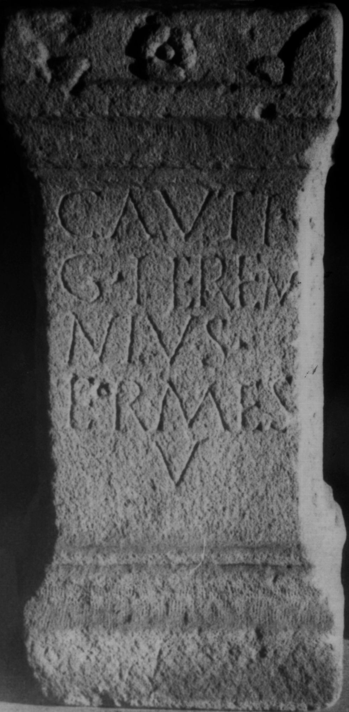

# EDH HD038011. Apulum

**Країна.** Румунія

**Провінція (код EDH).** Dac

**Місце знахідки (антична назва).** Apulum

**Сучасна назва.** Alba Iulia

**Деталі знахідки.** Festung, {Jesuitenkolleg}, sekundär verwendet

**Координати.** 46.068958174,23.572368621

**Рік знахідки.** 1622

**Зберігання.** Alba Iulia, Muz. Unirii

**Датування (роки, від'ємні до н. е.).** 201 … 270

**Матеріал.** Kalkstein

**Тип пам'ятки.** Altar

**Розміри (висота, ширина, глибина, см).** 65.0 × 30.0 × 27.0

## Текст (латинь, скорочення розкрито)

```
Cauti / G(aius) Heren/nius / (H)ermes / v(oto)
```

## Текст у вихідному записі

```
CAVTI / G HEREN / NIVS / ERMES / V
```

## Коментар

Fundjahr: 1622/23.

## Література

IDR 3, 5, 042; Foto u. Zeichnung.
- CIL 03, 00994. #

## Фото



Джерело https://edh.ub.uni-heidelberg.de/edh/inschrift/HD038011, ліцензія CC BY-SA 4.0. Оригінальний XML в архіві сирі_дані/edh_xml.zip
